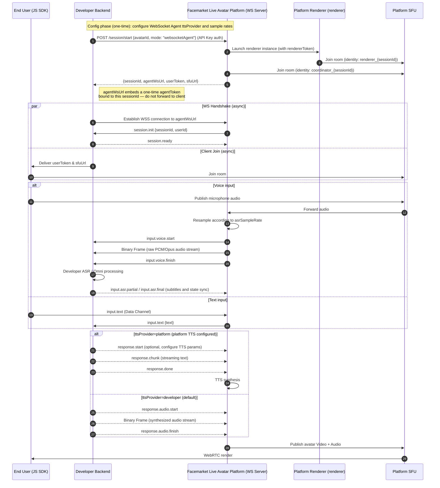
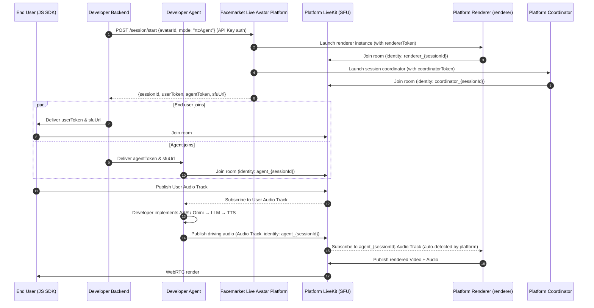
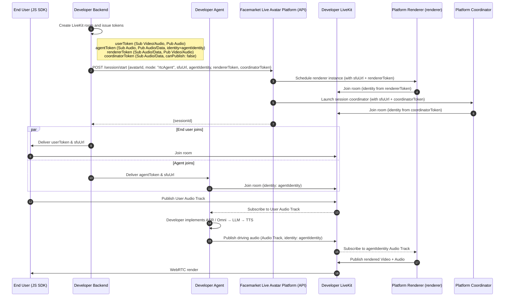

[English]() | [中文](./Live%20Avatar%20Integration%20Guide.zh-CN.md)

# I. Quick Start (Up and Running in 5 Minutes)

> In fully managed mode, the platform handles the full ASR → LLM → TTS pipeline. You only need to configure a system prompt in the console — add a single backend endpoint to exchange a token, and a few lines of frontend code to get your live avatar speaking.

> 💡 **Already have an API Key and avatar ID?** Skip Steps 1–2 — these are one-time setup. Go directly to [Step 3](#step-3-install-the-frontend-sdk).

## Step 1: Get an API Key

Log in to the console → go to **API Key Management** → click **Create API Key**, then copy and store it safely.

> ⚠️ The API Key must only be used **server-side**. Never embed it in frontend code or commit it to a repository.

## Step 2: Create a Live Avatar in the Console

Log in to the console, complete the following configuration, then click **Publish**:

- Upload an avatar asset (video / persona)
- Write a System Prompt (the avatar's role definition)
- Optional: configure a knowledge base, Skills, and voice

After publishing you will receive an avatar ID (the unique identifier for the avatar).

## Step 3: Install the Frontend SDK

```bash
npm install @sanseng/liveavatar-js-sdk
```

## Step 4: Exchange a sessionToken on the Backend

Use your API Key to call `/auth/session/token` and obtain a short-lived session credential to pass to the frontend:

```bash
curl -X POST "https://facemarket.ai/vih/dispatcher/auth/session/token" \
  -H "Authorization: Bearer <API_KEY>" \
  -H "Content-Type: application/json"
```

Response:

```json
{
  "code": 0,
  "data": {
    "token": "eyJ..."
  }
}
```

Deliver the `token` (i.e. `sessionToken`) to the frontend.

> `sessionToken` is valid for approximately 2 minutes. Refresh it before each session.

## Step 5: Connect from the Frontend

The frontend SDK uses the `sessionToken` to automatically initiate the session and join the room:

```ts
import { createClient } from '@sanseng/liveavatar-js-sdk';

const client = createClient({
  connectConfig: {
    type: 'auth',
    config: {
      avatarId: 'your-avatar-id'
      // authToken can be omitted here and set later via client.setAuthToken('...')
    },
  },
  video: {
    containerElement: document.getElementById('avatar')!,
  },
});

client.setAuthToken('jwt-or-business-token');
await client.connect();             // SDK internally calls /session/start and joins the RTC room
```

**At this point your live avatar is ready for conversation.** 🎉

---

> **Need to integrate your own LLM / Agent / business system?** Continue reading the advanced modes below.

---

# II. Choosing an Advanced Mode

If the fully managed mode does not meet your requirements, choose one of the following advanced modes based on your scenario:

| # | Mode | `mode` | Best For | Integration Effort |
| --- | --- | --- | --- | --- |
| 1 | **WebSocket Agent** | `websocketAgent` | Serverless / private network, full control over conversation logic | Low |
| 2 | **RTC Agent - Platform RTC** | `rtcAgent` | Custom voice agent, ultra-low latency, using platform LiveKit | High |
| 3 | **RTC Agent - BYO RTC** | `rtcAgent` + BYO runtime parameters | Private deployment, fully self-managed RTC infrastructure | Very High |


> `mode` selects the integration mode for the current session. If omitted, the Avatar's default mode is used. The platform initializes the session according to `mode`; mode-specific runtime parameters are supplied in the `/session/start` request body.

---

# III. Key Concepts

> We recommend reading this section before the chapters that follow. All terms used in the sequence diagrams and event descriptions are defined here.

## Identity & Credentials

| Concept | Description |
| --- | --- |
| **API key** | A long-lived credential generated by the developer in the console, used for server-side calls to the platform management API. **Must only be used on the backend; never expose to the frontend.** |
| **Session token** | A short-lived session credential (valid ~2 minutes). The backend exchanges it from the platform by calling `/auth/session/token` with the API Key, then delivers it to the frontend. The frontend uses it to call `/session/start` and initiate a session. **Used only in fully managed mode** — the developer does not need to deeply engage the backend. In WebSocket Agent and RTC Agent modes, the backend calls `/session/start` directly with the API Key; this token is not needed. |
| **User token** | The credential for an end user to join the RTC room. Issued by the platform (or by the developer in BYO RTC mode), embedding room name and user identity. |
| **Agent token** | The credential for the developer's agent to join the RTC room (RTC Agent mode only). |
| **Renderer token** | The credential for the renderer to join the developer's LiveKit room (BYO RTC mode only; issued by the developer and passed to the platform). |
| **Coordinator token** | The credential for the coordinator to join the developer's LiveKit room (BYO RTC mode only; issued by the developer and passed to the platform). |
| **Agent WS URL** | In WebSocket Agent mode, the dynamically allocated WebSocket endpoint for this session. It embeds a one-time token bound to the current `sessionId`. For **backend use only** — do not forward to the frontend. |

## Sessions & Rooms

| Concept | Description |
| --- | --- |
| **Room** | The complete interaction context for a conversation or call, carrying all participants' audio/video streams. If `roomId` is not passed to `/session/start`, the platform creates one automatically. Multiple Sessions in the same Room are supported for multi-avatar scenarios. |
| **Session** | The lifecycle of one avatar service instance, from calling `/session/start` until the connection is closed. Each call returns a unique `sessionId` and the associated `roomId`. |
| **SFU** | Selective Forwarding Unit (this platform uses LiveKit). Routes audio/video streams between room participants without requiring direct peer-to-peer connections. |

## Participant Roles

| Role | Identity Format | Description |
| --- | --- | --- |
| **user** | `user` | End user. Publishes microphone/camera; receives the avatar's video. Multiple users can share the same Room. |
| **coordinator** | `coordinator_{sessionId}` | Platform session coordinator. Must join in all modes. Handles state sync, control signaling, and session lifecycle; in fully managed mode it runs platform ASR/TTS, while in WebSocket Agent mode it handles audio forwarding, resampling, and optional platform TTS bridging. |
| **agent** | `agent_{sessionId}` | Developer's AI entity. In RTC Agent mode, subscribes to user media in the room, runs inference, and publishes the driving audio track. |
| **renderer** | `renderer_{sessionId}` | Platform rendering engine. Subscribes to the driving audio and generates lip-sync video, then publishes the Video + Audio Track. **Developers do not need to manage this.** |

## Technical Abbreviations

| Abbreviation | Full Form | Purpose |
| --- | --- | --- |
| **ASR** | Automatic Speech Recognition | Speech-to-text |
| **TTS** | Text-to-Speech | Converts text to audio to drive the avatar's speech |
| **VAD** | Voice Activity Detection | User speech start/stop boundary used to trigger interruption, state changes, and buffer clearing |
| **Data Channel** | LiveKit Data Channel | Low-latency text channel within the RTC room for control commands and text events; uses the same protocol format as WebSocket |

---

# IV. Start A New Session From Backend

For WebSocket Agent or RTC Agent integration, the session must be initiated via a server-to-server call. This step selects the current `mode`, allocates resources, prepares the renderer, and generates the necessary tokens for participants.

**Endpoint:** `POST /v1/session/start`

**URL:** `https://facemarket.ai/vih/dispatcher/v1/session/start`

**Authentication:** `Authorization: Bearer <API_KEY>`

### Request Body

**Request (New Session)**

```bash
curl -X POST "https://facemarket.ai/vih/dispatcher/v1/session/start" \
  -H "Authorization: Bearer <API_KEY>" \
  -H "Content-Type: application/json" \
  -d '{
    "avatarId": "string",
    "mode": "websocketAgent"
  }'
```

**Request (Reconnect — reuse existing session)**

```bash
curl -X POST "https://facemarket.ai/vih/dispatcher/v1/session/start" \
  -H "Authorization: Bearer <API_KEY>" \
  -H "Content-Type: application/json" \
  -d '{
    "avatarId": "string",
    "mode": "websocketAgent",
    "sessionId": "sess_xxx"
  }'
```

> `mode` is optional. If omitted, the Avatar default mode is used. When explicitly provided, the platform initializes the session using that mode. Common values: `managed`, `websocketAgent`, `rtcAgent`.
>
> **`sessionId` parameter**: omit to create a new Session + Room; include to reuse an existing Session (reconnect). The platform validates that the session is `active`, then refreshes all credentials and returns them. If the session has been `closed`, the API returns 403.

**Request (BYO RTC)**

```bash
curl -X POST "https://facemarket.ai/vih/dispatcher/v1/session/start" \
  -H "Authorization: Bearer <API_KEY>" \
  -H "Content-Type: application/json" \
  -d '{
    "avatarId": "string",
    "mode": "rtcAgent",
    "sessionId": "sess_xxx",
    "agentIdentity": "string",
    "sfuUrl": "string",
    "coordinatorToken": "string",
    "rendererToken": "string"
  }'
```

> In BYO RTC mode, `sessionId` is also optional: omit to create a new session, include to reuse an existing one. On reconnect, the developer must re-issue `rendererToken` and `coordinatorToken`.

### Request Parameters

| Parameter | Type | Required | Description |
|-----------|------|----------|-------------|
| `avatarId` | String | ✅ | Unique avatar identifier |
| `voiceId` | String | ❌ | Override the avatar's default voice for this session |
| `mode` | String | ❌ | Integration mode for this session. If omitted, uses the Avatar default mode. Values: `managed` / `websocketAgent` / `rtcAgent` |
| `sessionId` | String | ❌ | Include to reuse an existing session (reconnect); omit to create a new session |
| `sfuUrl` | String | ✅ BYO RTC | Developer LiveKit SFU URL; must be provided together with `agentIdentity` / `coordinatorToken` / `rendererToken` |
| `agentIdentity` | String | ✅ BYO RTC | Identity used by the developer agent in the LiveKit room; the platform renderer subscribes to this identity's Audio Track |
| `coordinatorToken` | String | ✅ BYO RTC | Token for coordinator to join the room; must be provided together with `sfuUrl` / `agentIdentity` / `rendererToken` |
| `rendererToken` | String | ✅ BYO RTC | Token for renderer to join the room; must be provided together with `sfuUrl` / `agentIdentity` / `coordinatorToken` |

Success Response (200 OK):

```json
{
  "code": 0,
  "message": "success",
  "data": {
    "sessionId": "sess_xxx",
    "sfuUrl": "wss://facemarket.ai/livekit",
    "userToken": "eyJ...",
    "agentToken": "eyJ...",
    "agentWsUrl": "wss://facemarket.ai/vih/dispatcher/v1/ws/agent?token=..."
  }
}
```

### Response Parameters

| Field | Type | Description |
| --- | --- | --- |
| `code` | int | 0 for success |
| `message` | String | Status message (e.g., "success") |
| `data.sessionId` | String | Unique identifier for the current session instance |
| `data.sfuUrl` | String | The LiveKit SFU endpoint for the JS SDK or Agent to join |
| `data.userToken` | String | Token for the end user (frontend) to join the room |
| `data.agentToken` | String | (RTC Agent - Platform RTC only) Token for the agent to join the room |
| `data.agentWsUrl` | String | (WebSocket Agent mode only) WebSocket URL for the developer backend to connect to the platform |

Standard Implementation Flow:

1. Backend service calls `POST /session/start`.
   - **New session**: pass `avatarId`; optionally pass `mode`.
   - **Reconnect**: pass `avatarId` + `sessionId`; optionally pass `mode`.
   - **BYO RTC**: pass `mode=rtcAgent` + `sfuUrl` + `agentIdentity` + `rendererToken` + `coordinatorToken`.
2. Platform service validates resources and initializes the streaming pipeline. On reconnect, the existing session and room are reused.
3. Backend service receives the payload; it must store the `sessionId` for tracking and future reconnects, and deliver the `userToken` + `sfuUrl` to the frontend client. On reconnect, old credentials are replaced with the new ones from the response.

### Stop a Session

**Endpoint:** `POST /v1/session/stop`

**URL:** `https://facemarket.ai/vih/dispatcher/v1/session/stop`

**Authentication:** `Authorization: Bearer <API_KEY>`

```bash
curl -X POST "https://facemarket.ai/vih/dispatcher/v1/session/stop" \
  -H "Authorization: Bearer <API_KEY>" \
  -H "Content-Type: application/json" \
  -d '{
    "sessionId": "sess_xxx"
  }'
```

Success Response (200 OK):

```json
{
  "code": 0,
  "message": "success"
}
```

You can also stop a session by sending the `session.stop` event via WebSocket or Data Channel, or by simply disconnecting from the RTC room.

---

Now you can start the avatar in your frontend:

```ts
import { createClient } from '@sanseng/liveavatar-js-sdk';

const client = createClient({
  connectConfig: {
    type: 'direct',
    config: {
      sfuUrl: 'wss://your-livekit-host',
      userToken: 'your-room-token',
    },
  },
  video: {
    containerElement: document.getElementById('avatar')!,
  },
});
await client.connect();

```

# V. WebSocket Agent Mode

In WebSocket Agent mode, the **platform owns the WS Server and dynamically allocates a WS endpoint (`agentWsUrl`) for each session. The developer backend actively connects to the platform**. Developers fully control conversation logic (LLM / Agent / business systems) while the platform handles RTC audio/video and avatar rendering. No public-facing server required.

In WebSocket Agent mode, ASR is always provided by the developer. The ASR audio path is: **frontend captures audio -> LiveKit -> the platform resamples according to the developer-configured ASR sample rate -> WebSocket Binary Frames are sent to the developer**. After running ASR, the developer should send `input.asr.partial` / `input.asr.final` back to the platform for subtitles, state sync, and debugging observability. TTS ownership is configured in the console:

| Field | Values | Default | Meaning |
| --- | --- | --- | --- |
| `ttsProvider` | `developer` / `platform` | `developer` | `platform` means the developer may return text and platform TTS synthesizes speech; `developer` means the developer must return synthesized audio via `response.audio.*` |
| `asrSampleRate` | Hz | `16000` | Developer-configured target sample rate for ASR input. After receiving user audio from LiveKit, the platform resamples to this rate before sending WebSocket Binary Frames to the developer ASR / Omni pipeline |
| `ttsSampleRate` | Hz | `24000` | Expected driving audio sample rate for renderer |

> `asrSampleRate` affects the resampling target before the platform forwards audio to developer ASR. It does not require the JS SDK to capture audio at that exact sample rate. The JS SDK captures and publishes audio to LiveKit; the platform subscribes to user audio, then outputs a stable WebSocket audio stream according to the developer-configured `asrSampleRate`.
>
> If platform TTS is not manually selected and configured with `ttsProviderId` / `voiceId` / `fallbackVoiceId`, the platform treats TTS as developer-provided. Channel count and sample depth are not user-configurable: Binary Frames are mono, and PCM sample depth is fixed at 2 bytes.



---

## 5.1 WebSocket Protocol Reference

> For the complete protocol definition see [PROTOCOL](PROTOCOL.md). This section lists the core events.

All text messages use three-segment event naming: `<domain>.<action>[.<stage>]`

### Platform → Developer (Downstream Events)

| Event | When it fires |
| --- | --- |
| `session.init` | Sent by the platform **immediately** after the WS connection is established |
| `input.text` | User sent text via Data Channel; platform forwards it |
| `input.voice.start` | Raw audio stream starts; also marks the user speech start boundary |
| `input.voice.finish` | Raw audio stream ends; also marks the user speech end boundary |
| `session.state` | State sync (IDLE / LISTENING / THINKING / SPEAKING, etc.) |
| `system.idleTrigger` | User has been inactive for an extended period |
| `session.closing` | Connection is about to close (e.g. timeout) |

### Developer → Platform (Upstream Events)

| Event | Description |
| --- | --- |
| `session.ready` | Handshake response — **must** be sent after receiving `session.init` |
| `input.asr.partial` | Streaming intermediate ASR result sent back by developer ASR; used by the platform for subtitles and state sync |
| `input.asr.final` | Final ASR result sent back by developer ASR; used by the platform for subtitles and state sync |
| `response.start` | Optional. Configure TTS parameters for this reply (speed / volume / mood). Only effective when `ttsProvider=platform` |
| `response.chunk` | Streaming text reply fragment; drives the Avatar only when `ttsProvider=platform` and platform TTS is configured |
| `response.done` | End-of-text signal; drives the Avatar only when `ttsProvider=platform` and platform TTS is configured |
| `response.audio.start` | Audio stream start; sent by the developer when `ttsProvider=developer` |
| `response.audio.finish` | Audio stream end; sent by the developer when `ttsProvider=developer` |
| `control.interrupt` | Interrupt the current avatar broadcast |
| `system.prompt` | Idle wake text (triggers the avatar to speak proactively) |
| `session.stop` | Request to end the current session |
| `error` | Error reporting |

### Audio Transport (Binary Frame)

Audio data is transmitted as **WebSocket binary frames** — no base64 encoding. Each frame format:

```plain
| Header (9 bytes) | Audio Payload (PCM / Opus) |
```

Binary Frames are used for two paths with the same format, only the direction differs:

- User audio input: in WebSocket Agent mode, after receiving user audio from LiveKit, the platform resamples according to `asrSampleRate` and sends mono Binary Frames to the developer.
- Developer audio output: when `ttsProvider=developer`, the developer sends synthesized mono audio Binary Frames that match `ttsSampleRate`.

Fixed audio format: channel count `1` (mono); PCM sample depth `2 bytes`; ASR input defaults to 16kHz and TTS output defaults to 24kHz, overrideable via `asrSampleRate` / `ttsSampleRate`.

For the complete Header field definition see [PROTOCOL](PROTOCOL.md).

### Java SDK

We provide a Java SDK for the WebSocket protocol that encapsulates the handshake, event parsing, and Binary Frame handling:

[https://github.com/newportAI-lab/liveavatar-channel](https://github.com/newportAI-lab/liveavatar-channel)

### Python SDK

We provide a Python SDK for the WebSocket protocol that encapsulates the handshake, event parsing, and Binary Frame handling:

[https://github.com/newportAI-lab/liveavatar-channel-python](https://github.com/newportAI-lab/liveavatar-channel-python)

---

# VI. RTC Agent Mode

In RTC Agent mode, the developer implements their own **agent** that subscribes to user audio directly in the RTC room, runs AI inference, and publishes the driving audio track. **The platform does not participate in the AI inference pipeline** — it only coordinates the session, subscribes to the agent's audio, and renders the avatar.

RTC Agent does not accept platform-side text input. If the developer needs a text entry point, handle it inside the developer Agent Pipeline and ultimately drive the Avatar via audio or control events.

The two sub-modes differ in **which party owns the LiveKit SFU**:

|  | Platform RTC | BYO RTC |
| --- | --- | --- |
| LiveKit owner | Platform | Developer |
| Token issuer | Platform issues `userToken` / `agentToken` | Developer issues `userToken` / `agentToken` / `rendererToken` / `coordinatorToken` |
| Developer responsibility | Implement Agent Pipeline (ASR / LLM / TTS or Omni / Voice Agent) | Implement Agent Pipeline + operate LiveKit infrastructure |
| Best for | Custom voice agent, fast integration | Private deployment, fully self-managed RTC |

---

## 6.1 RTC Agent - Platform RTC (Platform-owned LiveKit)

The platform owns the LiveKit SFU. The room contains four logical participant roles: end user, platform coordinator, platform renderer, and developer agent. The developer implements the agent and joins the room with the identity `agent_{sessionId}`. The **platform automatically subscribes to the Audio Track under that identity to drive the avatar's lip sync** — no additional configuration required.



**Identity & Permission Conventions**

| Role | Identity Format | LiveKit Permissions |
| --- | --- | --- |
| End User | `user_{userId}` | Subscribe Video/Audio; Publish Audio |
| coordinator | `coordinator_{sessionId}` | Subscribe Audio/Data; Publish Data |
| agent | `agent_{sessionId}` | Subscribe Audio; Publish Audio, Data |
| renderer | `renderer_{sessionId}` | Subscribe Audio/Data; Publish Video/Audio (managed internally by platform) |

The agent identity must be exactly `agent_{sessionId}`. The platform uses this identity to subscribe to the driving audio track.

**Best for**: AI developers building custom voice agents, private knowledge base Q&A, scenarios requiring full control over conversation logic.

### Python SDK

We provide a Python SDK for RTC Agent - Platform RTC mode that handles LiveKit room join, audio track subscribe/publish, and Data Channel communication:

[https://github.com/newportAI-lab/liveavatar-platform-rtc-python](https://github.com/newportAI-lab/liveavatar-platform-rtc-python)

---

## 6.2 RTC Agent - BYO RTC (Developer-owned LiveKit)

The platform shifts from "fully managed service provider" to a **"live avatar rendering plugin"**. All media streams flow entirely within the developer's SFU; the platform renderer and coordinator join the developer's LiveKit room as platform visitors. Token issuance authority belongs entirely to the developer.

BYO RTC is also described as separate logical coordinator / renderer roles. The implementation may merge these in the future, but public tokens, permissions, and protocol semantics remain separate.



**Token Issuance Reference**

| Role | Identity | Token Issuer | Network Requirement |
| --- | --- | --- | --- |
| End User | developer-defined user identity | Developer backend | Internal network is sufficient |
| agent | `agentIdentity` | Developer backend | Internal network is sufficient |
| renderer | identity embedded in `rendererToken` | Developer backend | Developer LiveKit must be publicly reachable |
| coordinator | identity embedded in `coordinatorToken` | Developer backend | Developer LiveKit must be publicly reachable |

> **Security note**: `rendererToken` should be set to least-privilege (Sub Audio/Data + Pub Video/Audio only); `coordinatorToken` should be set to `canPublish: false, canPublishData: true`. Both should have a validity of no more than 1 hour and are passed once via `/session/start` — **the platform does not retain them**.
>
> **agentIdentity constraint**: In BYO RTC, the agent identity is determined when the developer issues the agent token. The platform cannot infer it, so it must be explicitly provided via `/session/start.agentIdentity`. The platform renderer subscribes to the Audio Track published by that identity.
>
> **Constraint**: In BYO RTC, renderer / coordinator identities are determined by developer-issued tokens. To host multiple avatar instances in the same Room, ensure `rendererToken` / `coordinatorToken` / `agentIdentity` are isolated from each other. For standard multi-avatar support, use RTC Agent - Platform RTC.

**Best for**: Enterprise private deployment, existing complete RTC infrastructure, extreme low-latency requirements.

# VII. Frontend SDK Docs

Frontend integration code examples are in Chapter I, Quick Start Step 5.

The JS SDK provides richer capabilities (subtitle callbacks, emotion control, interrupt listeners, connection state management, and more). For the complete API reference see: [https://github.com/newportAI-lab/liveavatar-js-sdk](https://github.com/newportAI-lab/liveavatar-js-sdk)

---

# VIII. Testing with the Sandbox Environment

We provide 30 free minutes of testing quota per month in the sandbox environment. The sandbox uses the same protocol as production and supports full end-to-end flow verification.

To route a session to the sandbox, pass the header `X-Env-Sandbox: true`. The method differs depending on who calls `/session/start`:

## Backend Calls /session/start Directly

Add the header to your server-to-server request:

```bash
curl -X POST "https://facemarket.ai/vih/dispatcher/v1/session/start" \
  -H "Authorization: Bearer <API_KEY>" \
  -H "Content-Type: application/json" \
  -H "X-Env-Sandbox: true" \
  -d '{
    "avatarId": "string"
  }'
```

## Frontend SDK Calls /session/start (auth mode)

Set `sandbox: true` in the client config. The SDK automatically adds `X-Env-Sandbox: true` to every HTTP request:

```ts
import { createClient } from '@sanseng/liveavatar-js-sdk';

const client = createClient({
  connectConfig: {
    type: 'auth',
    config: { avatarId: 'demo-avatar' },
  },
  http: {
    baseURL: 'https://facemarket.ai/vih/dispatcher',
    headers: { /* custom static headers */ },
  },
  sandbox: true,
});
```

Custom headers in `http.headers` are merged with the sandbox header (when enabled) and sent together on every request.

---

# IX. FAQ

## Common Error Codes

Errors fall into two categories: **system errors** (temporary infrastructure issues — retry) and **actionable errors** (caused by your account state or request — the message tells you what to fix).

### System Errors (Retryable)

These indicate temporary resource constraints on the platform side. No action is needed on your part other than retrying:

| Error Code | Identifier | What It Means | Client-Facing Message |
|------------|------------|---------------|----------------------|
| 40001 | `NO_ORCHESTRATION_POD` | The scheduling layer is temporarily at capacity. This is a transient infrastructure condition. | `Service is temporarily unavailable. Please try again in a few seconds.` |
| 40002 | `NO_RENDERER_POD` | The rendering layer is temporarily at capacity. Same user experience as 40001. | Same as 40001 |
| 40003 | `SESSION_START_FAILED` | The session could not be initialized due to an internal processing error. | `Failed to launch virtual avatar. Please try again.` |

> For 40001 and 40002, implement a retry with a 2–3 second backoff. If the error persists beyond 3 retries, prompt the user to wait longer or contact support.

### Actionable Errors (Fix Required)

These errors indicate an issue with your account, configuration, or request. Read the message carefully — it tells you what to correct:

| Error Code | Identifier | What It Means | Client-Facing Message |
|------------|------------|---------------|----------------------|
| 40004 | `PRINCIPAL_UNIDENTIFIED` | The API key or credential in your request could not be mapped to a valid account. This usually means the key is missing, malformed, or has been deactivated. | `Unable to identify your account. Please check your API key or contact your administrator.` |
| 40005 | `CONCURRENCY_LIMIT_EXCEEDED` | You have reached the maximum number of simultaneous sessions allowed by your current subscription plan. Each plan includes a fixed number of concurrent avatar instances. | `Maximum concurrent sessions reached. Please close an active session and try again, or upgrade your plan.` |
| 40006 | `QUOTA_EXHAUSTED` | You have used all of the time or credit allocation included in your current plan. This could be monthly minutes, one-time trial credits, or a prepaid balance. | `Your usage limit has been reached. Please top up your account or upgrade your plan.` |
| 40007 | `SESSION_ACCESS_DENIED` | Your request attempted to access a session that belongs to a different account. This is an authorization boundary — you can only interact with sessions created under your own credentials. | `Access denied: you do not have permission to access this session. Please check the session ID and try again.` |

### Handling Guidance

| Scenario | Recommendation |
|----------|---------------|
| 40001 / 40002 persists | Retry up to 3 times with 2–3s backoff. If still failing, display the message and offer a "Contact Support" link. |
| 40003 | Retry once. If it persists, check your avatar configuration in the console (asset validity, publish status). |
| 40004 | Verify the `Authorization: Bearer <API_KEY>` header is present and the key is active in the console. If the key is valid, contact your account administrator. |
| 40005 | Close unused sessions via the console or API, or upgrade your plan for more concurrent slots. |
| 40006 | Check your usage dashboard in the console. Top up credits or upgrade to a plan with a higher limit. |
| 40007 | Verify the `sessionId` in your request belongs to your account. If you are attempting a reconnect, ensure you stored the correct `sessionId` from the original `/session/start` response. |

---

## Token & Authentication

### Q: How long is a sessionToken valid?

2 minutes. It is designed for one-time exchange — your backend calls `/auth/session/token`, delivers it to the frontend, and the frontend immediately calls `/session/start`. Do not cache or reuse a sessionToken.

### Q: What happens when the sessionToken expires?

The `/session/start` call returns `401 Unauthorized`. The frontend should request a fresh token from your backend and retry. In the JS SDK (auth mode), the SDK surfaces this as a connection error — listen to the `error` event and refresh the token from there.

### Q: Can I refresh a sessionToken without hitting my backend?

No. The token exchange requires your API Key, which must never be exposed to the frontend. Always route the refresh through your backend.

### Q: How do I rotate a compromised API Key?

1. Log in to the console → **API Key Management**.
2. Click **Deactivate** on the compromised key. All sessions using tokens issued by that key will fail on their next `session/start` call.
3. Click **Create API Key** to generate a new key.
4. Update your backend configuration with the new key.

### Q: Does deactivating an API Key kill active sessions?

No. Active sessions are bound to the session credentials, not the issuing API Key. The deactivation only blocks future `/auth/session/token` and `/session/start` calls that use the deactivated key.

---

## Session Lifecycle

### Q: How long does a session last?

There is no fixed maximum duration. A session stays active as long as the connection remains open and audio/video is flowing. Idle sessions (no user interaction) may be closed by the platform after a configured timeout — check your avatar settings in the console.

### Q: How do I end a session?

You can stop a session in three ways:

1. **REST API**: `POST /v1/session/stop` with `{ "sessionId": "sess_xxx" }` (authenticated with API Key, same base URL as `/session/start`).
2. **Data Channel / WebSocket**: send the `session.stop` event from your agent or frontend.
3. **Connection-driven**: disconnecting from the RTC room or WebSocket also triggers teardown.

### Q: What should I do when I receive session.closing?

1. Stop sending new events or audio frames to the platform.
2. Close the WebSocket connection from your side.
3. Do not attempt to reconnect with the same `sessionId` — a closing session cannot be reused. Call `/session/start` without a `sessionId` to create a new one.

### Q: Can I reuse a sessionId after disconnect?

Only if the session is still `active`. Call `/session/start` with the `sessionId` to reconnect. If the session has been closed (timeout, idle, explicit disconnect), the API returns `403` — create a new session instead.

### Q: What triggers the idle wake-up event?

The platform's session state machine monitors user interaction. When the user has been inactive and the session enters an idle state for the configured duration, the platform fires `system.idleTrigger`. Your agent can respond with a proactive message via `system.prompt`.

---

## Reconnection & Recovery

### Q: How do I reconnect after a network drop?

Call `POST /v1/session/start` with `{ "avatarId": "...", "sessionId": "sess_xxx" }`. The platform validates that the session is still `active`, then returns fresh credentials (`userToken`, `sfuUrl`, etc.). Use these new credentials to rejoin — do not reuse old tokens.

### Q: What happens to the old tokens after reconnection?

The old tokens are invalidated immediately. All participants must use the new tokens from the reconnection response.

### Q: What if the session has already been closed when I try to reconnect?

The API returns `403 Forbidden`. The session may have been closed due to idle timeout, explicit stop, or an internal error. Call `/session/start` without a `sessionId` to create a new session.

### Q: Does the frontend SDK handle reconnection automatically?

Auto-reconnect is on the SDK roadmap for a future release. In the current version, you should listen to the connection state events and implement your own retry logic — call your backend to re-run `/session/start` with the existing `sessionId`, then feed the new credentials to the SDK via `client.connect()`.

### Q: In WebSocket Agent mode, what happens if the WS connection drops?

Call `/session/start` with the `sessionId` to get a new `agentWsUrl`, then reconnect. Ensure your backend handles duplicate `session.init` gracefully (check if `sessionId` is already active and respond with `session.ready`).

---

## Sandbox vs Production

### Q: What are the limits of the sandbox environment?

| Resource | Sandbox Limit |
|----------|--------------|
| Monthly usage | 30 free minutes |
| Concurrent sessions | 1 |
| Avatar assets | Limited to sandbox-created avatars |

Production plans have higher or unlimited quotas depending on your subscription tier.

### Q: Are there any functional differences between sandbox and production?

No. The sandbox uses the same protocols, endpoints, and rendering pipeline as production. The only difference is quota enforcement. This means you can develop and test your full integration in sandbox and switch to production with zero code changes.

### Q: How do I switch from sandbox to production?

Remove the `X-Env-Sandbox: true` header from your backend requests, or set `sandbox: false` (or omit it) in the frontend SDK config. That's it — the base URL and all API contracts are identical.

### Q: How do I check my remaining sandbox quota?

Log in to the console → navigate to the usage dashboard. The sandbox section shows your remaining minutes for the current billing cycle.

---

## WebSocket Integration

### Q: Why shouldn't I share the agentWsUrl with the frontend?

The `agentWsUrl` embeds a one-time token bound to the current `sessionId`. If exposed to the frontend:

- The token can be used by a malicious client to impersonate your agent and inject conversation content.
- The token is single-use — the frontend consuming it would prevent your backend from connecting.

Always keep `agentWsUrl` on your backend.

### Q: What is the byte order of binary audio frames?

All binary frame header fields use **network byte order (big-endian)**. The audio payload format (PCM or Opus) is negotiated during session configuration — check your avatar settings in the console.

### Q: Can I mix text and audio responses in the same session?

Only when `ttsProvider=platform` and platform TTS is configured can `response.chunk` / `response.done` drive the Avatar. If `ttsProvider=developer`, the developer must return synthesized audio via `response.audio.*`.

### Q: What happens if I send malformed JSON in a text message?

The platform closes the WebSocket connection with a close code of `1002` (protocol error). Ensure your JSON is well-formed and matches the event schema defined in the protocol reference.

---

## RTC Agent Integration

### Q: What happens if my agent joins with the wrong identity?

The platform renderer subscribes to a specific agent identity.

- RTC Agent - Platform RTC: the agent identity must be `agent_{sessionId}`.
- RTC Agent - BYO RTC: the agent identity is determined when the developer issues the token, must be explicitly provided via `/session/start.agentIdentity`, and must exactly match the identity used by the actual agent in the room.

### Q: In BYO RTC mode, the renderer cannot join my LiveKit room. How do I debug?

1. Verify your `sfuUrl` is publicly reachable from the internet.
2. Confirm the `rendererToken` has not expired and includes the correct room name.
3. Check that the token grants `canPublish: true` and `canSubscribe: true` for both audio and video.
4. Ensure your LiveKit server's `rtc_config.tcp_port` (default 7881) and `rtc_config.udp_port` range are open to inbound traffic.
5. Contact support with the session ID and the approximate timestamp of the failed join attempt.

### Q: Do I need to manage renderer lifecycle in BYO RTC mode?

No. The platform manages renderer startup and shutdown via the `/session/start` and `/session/stop` API calls. You only need to issue valid tokens and keep your LiveKit room accessible.

### Q: Can I have multiple agents in the same room?

In RTC Agent - Platform RTC mode, each session has exactly one `agent_{sessionId}` identity. To have multiple agent instances, create multiple sessions (one per agent) in the same room by passing the same `roomId` on each `/session/start` call. Each agent joins with its own session-scoped identity. Note that each session consumes a concurrent slot on your plan.

---

## Troubleshooting

### Q: The API returned success but I see a black screen. What do I check?

Walk through these steps in order:

1. **Credentials**: confirm the frontend received a valid `userToken` and `sfuUrl` from your backend.
2. **Network**: verify the client can reach `sfuUrl` on port 443 — corporate firewalls or VPNs may block WebRTC traffic.
3. **Browser**: ensure you are using a WebRTC-supported browser (see the supported browser table below).
4. **Console logs**: open the browser DevTools → Console and look for LiveKit connection errors or SDK warnings.
5. **Session state**: check whether `/session/start` returned a valid `sessionId` and your backend stored it correctly.

### Q: Audio works but the avatar's lips don't move. Why?

This usually means the renderer is not receiving the driving audio track. Common causes:

- **WebSocket mode**: verify your `response.chunk` / `response.audio.*` events are sent in the correct sequence (`response.start` → `response.chunk` → `response.done`, or `response.audio.start` → binary frames → `response.audio.finish`).
- **RTC Agent - Platform RTC**: confirm your agent publishes audio under `agent_{sessionId}` and the track is not muted.
- **RTC Agent - BYO RTC**: confirm `/session/start.agentIdentity` exactly matches the identity used by the actual agent in the room, and that the audio track is not muted.
- **Audio format**: ensure the audio format (sample rate, encoding) matches your avatar's configuration.

### Q: The avatar responds slowly. What can I optimize?

Latency accumulates across the pipeline. Check each stage:

1. **Network**: minimize the physical distance between your backend and the platform's servers. For WebSocket mode, deploy your agent close to the platform region.
2. **LLM**: use streaming responses. Send `response.chunk` as soon as the first token arrives — do not wait for the full response.
3. **TTS**: if using platform TTS, streaming synthesis begins on the first `response.chunk`. Sending text earlier means audio starts sooner.
4. **SDK buffer**: the JS SDK maintains a small jitter buffer for smooth playback. This is not configurable in the current version.

### Q: Which browsers are supported?

| Browser | Minimum Version | Status |
|---------|----------------|--------|
| Chrome | 90+ | Supported |
| Edge | 90+ | Supported |
| Firefox | 90+ | Supported |
| Chrome for Android | 90+ | Supported |
| Safari | 15+ | Supported |
| Mobile Safari (iOS) | 15+ | Supported |

WebRTC is required. Browsers in private/incognito mode may have limited WebRTC support — test in normal mode first.

---

## Contacting Support

### Q: What information should I include when reporting an issue?

Providing the following upfront will significantly speed up diagnosis:

| Item | Why It Helps |
|------|-------------|
| `sessionId` | Pinpoints the exact session and all associated logs |
| Approximate UTC timestamp | Correlates events across distributed systems |
| Error code (e.g. 40005) | Narrows the root cause immediately |
| Integration mode | Tells us which pipeline to inspect (Fully Managed / WebSocket Agent / RTC Agent - Platform RTC / RTC Agent - BYO RTC) |
| `avatarId` | Links to your specific avatar configuration |
| Client-side logs | Browser console output or SDK error events |
| Network topology (BYO RTC) | Your LiveKit server region and any proxy/CDN in front of it |

### Q: How do I reach support?

- **Email**: send details to [techsupport@newportai.com](mailto:techsupport@newportai.com).
- **GitHub Issues**: report integration problems and feature requests at [liveavatar-integration-guide/issues](https://github.com/newportAI-lab/liveavatar-integration-guide/issues).
