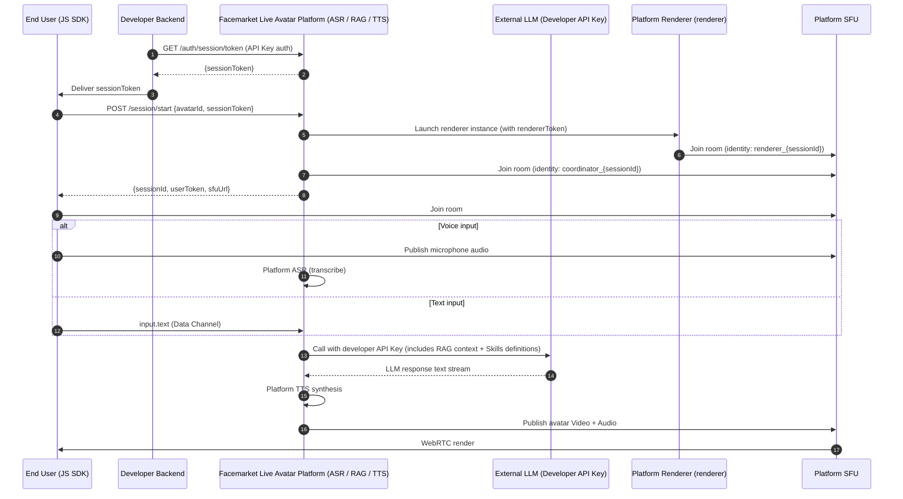
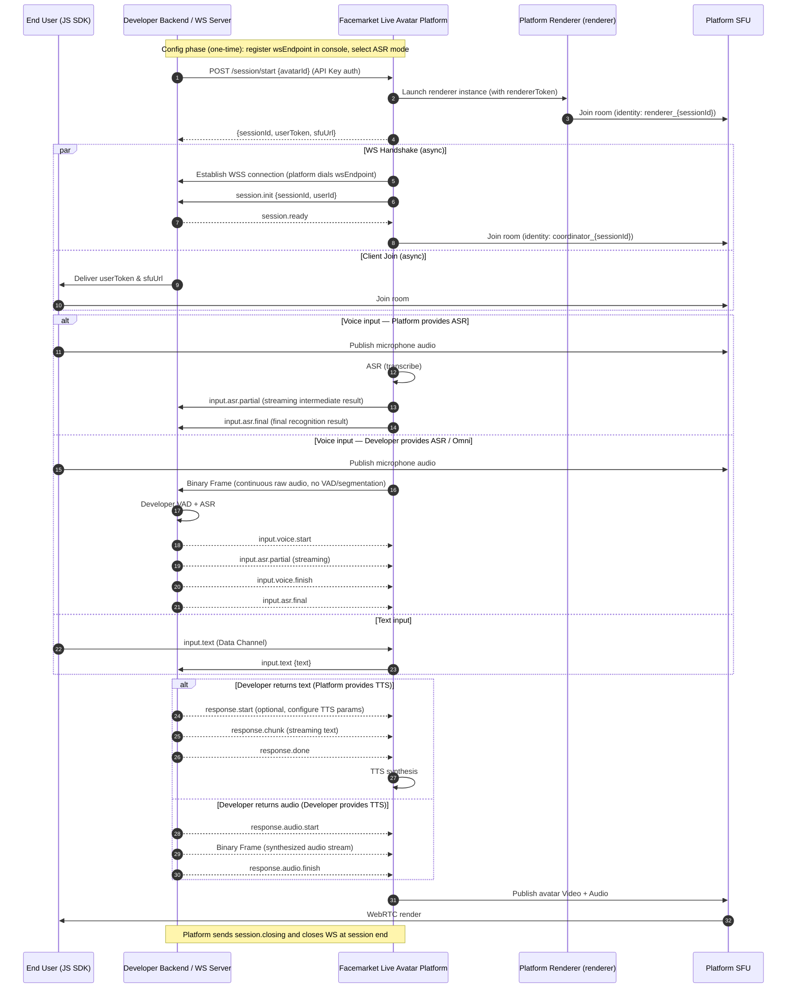
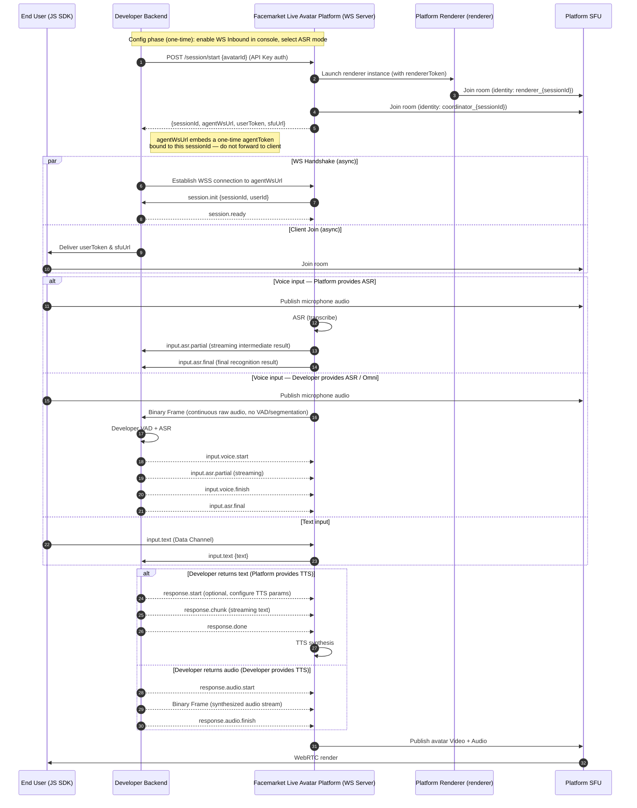
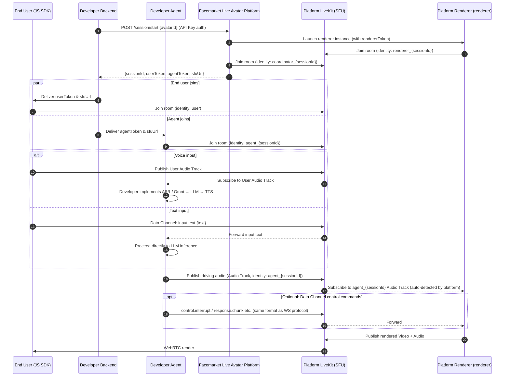
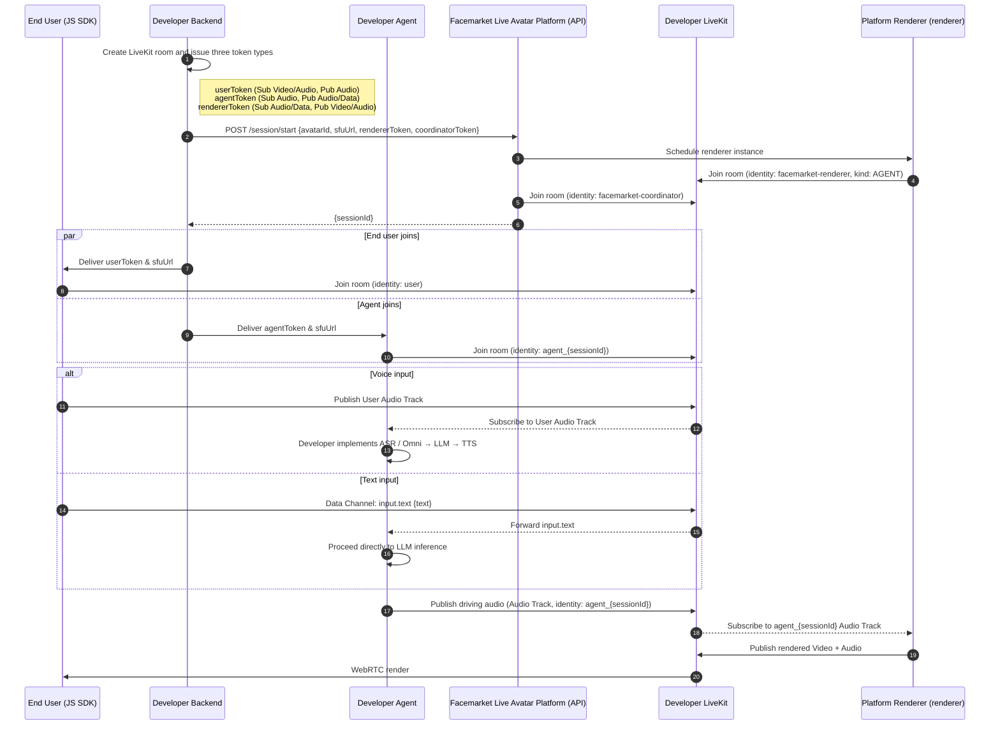

# I. Quick Start (Up and Running in 5 Minutes)

> In default mode, the platform handles the full ASR → LLM → TTS pipeline. You only need to configure a system prompt in the console — add a single backend endpoint to exchange a token, and a few lines of frontend code to get your live avatar speaking.

> 💡 **Already have an API Key and avatar ID?** Skip Steps 1–2 — these are one-time setup. Go directly to [Step 3](#step-3-install-the-frontend-sdk).

## Step 1: Get an API Key

Log in to the console → go to **API Key Management** → click **Create API Key**, then copy and store it safely.

> ⚠️ The API Key must only be used **server-side**. Never embed it in frontend code or commit it to a repository.

## Step 2: Create a Live Avatar in the Console

Log in to the console, complete the following configuration, then click **Publish**:

- Upload an avatar asset (video / persona)
- Write a System Prompt (the avatar's role definition)
- Optional: configure a knowledge base, Skills, and voice

After publishing you will receive an avatar ID (the unique identifier for the avatar).

## Step 3: Install the Frontend SDK

```bash
npm install @sanseng/liveavatar-js-sdk
```

## Step 4: Exchange a sessionToken on the Backend

Use your API Key to call `/auth/session/token` and obtain a short-lived session credential to pass to the frontend:

```bash
curl -X POST "https://facemarket.ai/vih/dispatcher/auth/session/token" \
  -H "Authorization: Bearer <API_KEY>" \
  -H "Content-Type: application/json"
```

Response:

```json
{
  "code": 0,
  "data": {
    "token": "eyJ..."
  }
}
```

Deliver the `token` (i.e. `sessionToken`) to the frontend.

> `sessionToken` is valid for approximately 2 minutes. Refresh it before each session.

## Step 5: Connect from the Frontend

The frontend SDK uses the `sessionToken` to automatically initiate the session and join the room:

```ts
import { createClient } from '@sanseng/liveavatar-js-sdk';

const client = createClient({
  connectConfig: {
    type: 'auth',
    config: {
      avatarId: 'your-avatar-id'
      // authToken can be omitted here and set later via client.setAuthToken('...')
    },
  },
  video: {
    containerElement: document.getElementById('avatar')!,
  },
});

client.setAuthToken('jwt-or-business-token');
await client.connect();             // SDK internally calls /session/start and joins the RTC room
```

**At this point your live avatar is ready for conversation.** 🎉

---

> **Need to integrate your own LLM / Agent / business system?** Continue reading the advanced modes below.

---

# II. Choosing an Advanced Mode

If the default mode does not meet your requirements, choose one of the following advanced modes based on your scenario:

| # | Mode | Best For | Integration Effort |
| --- | --- | --- | --- |
| 1 | **API Key Hosting** | Bring your own LLM without maintaining inference infrastructure | Low |
| 2 | **WS Outbound** | Public-facing backend, full control over conversation logic | Medium |
| 3 | **WS Inbound** | Serverless / private network, full control over conversation logic | Low |
| 4 | **Platform RTC** | Custom voice agent, ultra-low latency | High |
| 5 | **BYO RTC** | Private deployment, fully self-managed RTC infrastructure | Very High |

---

# III. Key Concepts

> We recommend reading this section before the chapters that follow. All terms used in the sequence diagrams and event descriptions are defined here.

## Identity & Credentials

| Concept | Description |
| --- | --- |
| **API Key** | A long-lived credential generated by the developer in the console, used for server-side calls to the platform management API. **Must only be used on the backend; never expose to the frontend.** |
| **sessionToken** | A short-lived session credential (valid ~2 minutes). The backend exchanges it from the platform by calling `/auth/session/token` with the API Key, then delivers it to the frontend. The frontend uses it to call `/session/start` and initiate a session. **Used only in default mode (fully managed) and API Key Hosting mode** — in both cases the developer does not need to deeply engage the backend. In WS and RTC modes, the backend calls `/session/start` directly with the API Key; this token is not needed. |
| **userToken** | The credential for an end user to join the RTC room. Issued by the platform (or by the developer in BYO RTC mode), embedding room name and user identity. |
| **agentToken** | The credential for the developer's agent to join the RTC room (WebRTC modes only). |
| **rendererToken** | The credential for the renderer to join the developer's LiveKit room (BYO RTC mode only; issued by the developer and passed to the platform). |
| **coordinatorToken** | The credential for the coordinator to join the developer's LiveKit room (BYO RTC mode only; issued by the developer and passed to the platform). |
| **agentWsUrl** | In WS Inbound mode, the dynamically allocated WebSocket endpoint for this session. It embeds a one-time token bound to the current `sessionId`. For **backend use only** — do not forward to the frontend. |

## Sessions & Rooms

| Concept | Description |
| --- | --- |
| **Room** | The complete interaction context for a conversation or call, carrying all participants' audio/video streams. If `roomId` is not passed to `/session/start`, the platform creates one automatically. Multiple Sessions in the same Room are supported for multi-avatar scenarios. |
| **Session** | The lifecycle of one avatar service instance, from calling `/session/start` until the connection is closed. Each call returns a unique `sessionId` and the associated `roomId`. |
| **SFU** | Selective Forwarding Unit (this platform uses LiveKit). Routes audio/video streams between room participants without requiring direct peer-to-peer connections. |

## Participant Roles

| Role | Identity Format | Description |
| --- | --- | --- |
| **user** | `user` | End user. Publishes microphone/camera; receives the avatar's video. Multiple users can share the same Room. |
| **coordinator** | `coordinator_{sessionId}` | Platform conversation coordinator. Must join in all modes. Handles speech recognition and state sync; TTS audio is delivered directly to the renderer via gRPC. |
| **agent** | `agent_{sessionId}` | Developer's AI entity. In Platform RTC mode, subscribes to user media in the room, runs inference, and publishes the driving audio track. |
| **renderer** | `renderer_{sessionId}` | Platform rendering engine. Subscribes to the driving audio and generates lip-sync video, then publishes the Video + Audio Track. **Developers do not need to manage this.** |

## Technical Abbreviations

| Abbreviation | Full Form | Purpose |
| --- | --- | --- |
| **ASR** | Automatic Speech Recognition | Speech-to-text |
| **TTS** | Text-to-Speech | Converts text to audio to drive the avatar's speech |
| **VAD** | Voice Activity Detection | Detects whether the user is speaking (start/stop), used to trigger interrupt logic |
| **Data Channel** | LiveKit Data Channel | Low-latency text channel within the RTC room for control commands and text events; uses the same protocol format as WebSocket |

---

# IV. API Key Hosting Mode

The platform proxies calls to a developer-specified external LLM (OpenAI, Claude, Qwen, etc.). Developers only need to enter their LLM API Key in the console — **no inference service to deploy**. The platform handles ASR, RAG retrieval, and TTS synthesis.



### API Key Security Guarantees

We understand that hosting an API Key with a third-party platform is a significant trust decision. The platform provides the following protections:

- **Encryption in transit**: API Keys are transmitted over HTTPS/TLS and never pass through any plaintext channel.
- **Encryption at rest**: The platform uses **AES-256** to encrypt stored API Keys; no plaintext form is retained in the database.
- **Least privilege**: The platform uses the Key only when proxying calls to the external LLM and for no other purpose. All operations are auditable in the console audit log.
- **Revocable at any time**: You can replace or delete a configured API Key from the console at any time; changes take effect immediately.

> If you are still concerned about hosting an API Key with a third party, we recommend **WS Outbound / Inbound mode** — LLM inference runs entirely on your own servers and the platform never touches your Key.

**Best for**: Quickly launching a custom AI assistant; using a model of your choice without managing inference infrastructure.

---

# V. Start A New Session From Backend

Integration with WebSocket or WebRTC mode, the session must be initiated via a server-to-server call. This step allocates resources, prepares the renderer, and generates the necessary tokens for participants.

Start a live avatar session.

**Request (New Session)**

```bash
curl -X POST "https://facemarket.ai/vih/dispatcher/v1/session/start" \
  -H "Authorization: Bearer <API_KEY>" \
  -H "Content-Type: application/json" \
  -d '{
    "avatarId": "string"
  }'
```

**Request (Reconnect — reuse existing session)**

```bash
curl -X POST "https://facemarket.ai/vih/dispatcher/v1/session/start" \
  -H "Authorization: Bearer <API_KEY>" \
  -H "Content-Type: application/json" \
  -d '{
    "avatarId": "string",
    "sessionId": "sess_xxx"
  }'
```

> **`sessionId` parameter**: omit to create a new Session + Room; include to reuse an existing Session (reconnect). The platform validates that the session is `active`, then refreshes all credentials and returns them. If the session has been `closed`, the API returns 403.

**Request (BYO RTC)**

```bash
curl -X POST "https://facemarket.ai/vih/dispatcher/v1/session/start" \
  -H "Authorization: Bearer <API_KEY>" \
  -H "Content-Type: application/json" \
  -d '{
    "avatarId": "string",
    "sessionId": "sess_xxx",
    "roomName": "string",
    "agentIdentity": "string",
    "sfuUrl": "string",
    "coordinatorToken": "string",
    "rendererToken": "string"
  }'
```

> In BYO RTC mode, `sessionId` is also optional: omit to create a new session, include to reuse an existing one. On reconnect, the developer must re-issue `rendererToken` and `coordinatorToken`.

### Request Parameters

| Parameter | Type | Required | Description |
|-----------|------|----------|-------------|
| `avatarId` | String | ✅ | Unique avatar identifier |
| `sessionId` | String | ❌ | Include to reuse an existing session (reconnect); omit to create a new session |
| `roomName` | String | ✅ BYO RTC | Developer LiveKit room name |
| `agentIdentity` | String | ✅ BYO RTC | Agent identity |
| `sfuUrl` | String | ✅ BYO RTC | Developer LiveKit SFU URL |
| `coordinatorToken` | String | ✅ BYO RTC | Token for coordinator to join the room |
| `rendererToken` | String | ✅ BYO RTC | Token for renderer to join the room |

Success Response (200 OK):

```json
{
  "code": 0,
  "message": "success",
  "data": {
    "sessionId": "sess_xxx",
    "sfuUrl": "wss://facemarket.ai/livekit",
    "userToken": "eyJ...",
    "agentToken": "eyJ...",
    "agentWsUrl": "wss://facemarket.ai/vih/dispatcher/v1/ws/agent?token=..."
  }
}
```

| Field | Type | Mode | Description |
| --- | --- | --- | --- |
| `code` | int | All | 0 for success |
| `message` | String | All | Status message (e.g., "success") |
| `data.sessionId` | String | All | Unique identifier for the current session instance |
| `data.sfuUrl` | String | Platform RTC / WS | The LiveKit SFU endpoint for the JS SDK / Agent to join |
| `data.userToken` | String | Platform RTC / WS | Token for the end user (frontend) to join the room |
| `data.agentToken` | String | Platform RTC only | Token for the agent to join the room |
| `data.agentWsUrl` | String | WS Inbound only | WebSocket URL for the developer backend to connect to the platform |

Standard Implementation Flow:

1. Backend service calls POST /session/start.
   - **New session**: pass only `avatarId`
   - **Reconnect**: pass `avatarId` + `sessionId`
2. Platform service validates resources and initializes the streaming pipeline. On reconnect, the existing session and room are reused.
3. Backend service receives the payload; it must store the `sessionId` for tracking and future reconnects, and deliver the `userToken` + `sfuUrl` to the frontend client. On reconnect, old credentials are replaced with the new ones from the response.

Now you can start the avatar in your frontend:

```ts
import { createClient } from '@sanseng/liveavatar-js-sdk';

const client = createClient({
  connectConfig: {
    type: 'direct',
    config: {
      sfuUrl: 'wss://your-livekit-host',
      userToken: 'your-room-token',
    },
  },
  video: {
    containerElement: document.getElementById('avatar')!,
  },
});
await client.connect();

```

# VI. WebSocket Integration Mode

In WebSocket mode, the developer backend fully controls conversation logic (LLM / Agent / business systems) while the platform handles RTC audio/video and avatar rendering.

Both sub-modes use the **exact same protocol**. The only difference is which party **initiates** the WebSocket connection:

|  | WS Outbound | WS Inbound |
| --- | --- | --- |
| WS Server owner | **Developer** | **Platform** |
| Connection initiator | Platform connects to developer | Developer connects to platform |
| Requires public server | ✅ Yes | ❌ No |
| Best for | Enterprise intranet, existing backend | Serverless, local development |

---

## 6.1 WS Outbound (Platform Connects to Developer WS)

The developer deploys a WebSocket server and registers its address (`wsEndpoint`) in the Avatar configuration. After the session starts, the **platform actively connects** to the developer's WS Server.



---

## 6.2 WS Inbound (Developer Connects to Platform WS)

The platform dynamically allocates a WS endpoint (`agentWsUrl`) for each session. The **developer backend actively connects** to the platform. No public-facing server required.



> **Inbound and Outbound use identical protocols** — handshake, event format, and Binary Frame format are all the same; only the connection initiation differs. Business logic code written for one mode can be reused in the other.

---

## 6.3 WebSocket Protocol Reference

> For the complete protocol definition see [PROTOCOL](PROTOCOL.md). This section lists the core events.

All text messages use three-segment event naming: `<domain>.<action>[.<stage>]`

### Platform → Developer (Downstream Events)

| Event | When it fires |
| --- | --- |
| `session.init` | Sent by the platform **immediately** after the WS connection is established (both Inbound and Outbound) |
| `input.text` | User sent text via Data Channel; platform forwards it |
| `input.asr.partial` | Streaming intermediate ASR result (sent by platform when platform provides ASR) |
| `input.asr.final` | Final ASR recognition result (sent by platform when platform provides ASR) |
| `input.voice.start` | VAD detected user started speaking; in Developer ASR / Omni mode, the platform auto-clears the RTC playback buffer on receipt |
| `input.voice.finish` | VAD detected user stopped speaking |
| `session.state` | State sync (IDLE / LISTENING / THINKING / SPEAKING, etc.) |
| `system.idleTrigger` | User has been inactive for an extended period |
| `session.closing` | Connection is about to close (e.g. timeout) |

### Developer → Platform (Upstream Events)

| Event | Description |
| --- | --- |
| `session.ready` | Handshake response — **must** be sent after receiving `session.init` |
| `response.start` | Optional. Configure TTS parameters for this reply (speed / volume / mood). Only effective when **platform provides TTS** |
| `response.chunk` | Streaming text reply fragment |
| `response.done` | End-of-text signal|
| `response.audio.start` | Audio stream start. **Sent by whoever provides TTS** (developer when developer provides TTS; platform when platform provides TTS) |
| `response.audio.finish` | Audio stream end. **Sent by whoever provides TTS** (same rule) |
| `control.interrupt` | Explicit programmatic interrupt (for scenarios not triggered by user input, e.g. backend timeout or business-logic override; the platform auto-clears the buffer on `input.text` and `input.voice.start`, so no explicit interrupt is needed in those flows) |
| `system.prompt` | Idle wake text (triggers the avatar to speak proactively) |
| `error` | Error reporting |

### Audio Transport (Binary Frame)

Audio data is transmitted as **WebSocket binary frames** — no base64 encoding. Each frame format:

```plain
| Header (9 bytes) | Audio Payload (PCM / Opus) |
```

Binary Frames are used for two paths with the same format, only the direction differs:

- `input.voice.*` (bidirectional): whoever provides ASR sends it, developer pushes when developer provides ASR; platform pushes when platform provides ASR
- `response.audio.*` (bidirectional): whoever provides TTS sends it — developer pushes when developer provides TTS; platform pushes when platform provides TTS

For the complete Header field definition see [PROTOCOL](PROTOCOL.md).

### Java SDK

We provide a Java SDK for the WebSocket protocol that encapsulates the handshake, event parsing, and Binary Frame handling:

[https://github.com/newportAI-lab/liveavatar-channel](https://github.com/newportAI-lab/liveavatar-channel)

### Python SDK

We provide a Python SDK for the WebSocket protocol that encapsulates the handshake, event parsing, and Binary Frame handling:

[https://github.com/newportAI-lab/liveavatar-channel-python](https://github.com/newportAI-lab/liveavatar-channel-python)

---

# VII. WebRTC Integration Mode

In WebRTC mode, the developer implements their own **agent** that subscribes to user audio directly in the RTC room, runs AI inference, and publishes the driving audio track. **The platform does not participate in the AI inference pipeline** — it only subscribes to the agent's audio and renders the avatar.

The two sub-modes differ in **which party owns the LiveKit SFU**:

|  | Platform RTC | BYO RTC |
| --- | --- | --- |
| LiveKit owner | Platform | Developer |
| Token issuer | Platform | Developer |
| Best for | Custom AI agent, fast integration | Private deployment, fully self-managed RTC |

---

## 7.1 Platform RTC (Platform-owned LiveKit)

The platform owns the LiveKit SFU. After the developer implements an agent, it joins the room with the identity `agent_{sessionId}`. The **platform automatically subscribes to the Audio Track under that identity to drive the avatar's lip sync** — no additional configuration required.



**Identity & Permission Conventions**

| Role | Identity Format | LiveKit Permissions |
| --- | --- | --- |
| End User | `user` | Subscribe Video/Audio; Publish Audio |
| agent | `agent_{sessionId}` | Subscribe Audio; Publish Audio, Data |
| renderer | `renderer_{sessionId}` | Subscribe Audio/Data; Publish Video/Audio (managed internally by platform) |

⚠️ The agent's identity **must** begin with `agent_` — the platform uses this prefix to automatically subscribe to the driving audio track.

**Best for**: AI developers building custom voice agents, private knowledge base Q&A, scenarios requiring full control over conversation logic.

---

## 7.2 BYO RTC (Developer-owned LiveKit)

The platform shifts from "fully managed service provider" to a **"live avatar rendering plugin"**. All media streams flow entirely within the developer's SFU; the platform renderer joins the developer's LiveKit room as a participant. Token issuance authority belongs entirely to the developer.



**Token Issuance Reference**

| Role | Identity | Token Issuer | Network Requirement |
| --- | --- | --- | --- |
| End User | `user` | Developer backend | Internal network is sufficient |
| agent | `agent` | Developer backend | Internal network is sufficient |
| renderer | `facemarket-renderer` | Auto-issued by plugin (or developer backend when calling the API directly) | Developer LiveKit must be publicly reachable |
| coordinator | `facemarket-coordinator` | Auto-issued by plugin (or developer backend when calling the API directly) | Developer LiveKit must be publicly reachable |

> **Security note**: `rendererToken` should be set to least-privilege (Sub Audio/Data + Pub Video/Audio only); `coordinatorToken` should be set to `canPublish: false, canPublishData: true`. Both should have a validity of no more than 1 hour and are passed once via `/session/start` — **the platform does not retain them**.
>
> **Constraint**: BYO RTC uses fixed identities, so **only one avatar instance can exist in a Room at a time**. For multi-avatar scenarios, use Platform RTC.

**Best for**: Enterprise private deployment, existing complete RTC infrastructure, extreme low-latency requirements.

---

# VIII. Frontend SDK Docs

Frontend integration code examples are in Chapter I, Quick Start Step 5.

The JS SDK provides richer capabilities (subtitle callbacks, emotion control, interrupt listeners, connection state management, and more). For the complete API reference see: [https://github.com/newportAI-lab/liveavatar-js-sdk](https://github.com/newportAI-lab/liveavatar-js-sdk)

---

# IX. Testing with the Sandbox Environment

We provide 30 free minutes of testing quota per month in the sandbox environment. The sandbox uses the same protocol as production and supports full end-to-end flow verification.

To route a session to the sandbox, pass the header `X-Env-Sandbox: true`. The method differs depending on who calls `/session/start`:

## Backend Calls /session/start Directly

Add the header to your server-to-server request:

```bash
curl -X POST "https://facemarket.ai/vih/dispatcher/v1/session/start" \
  -H "Authorization: Bearer <API_KEY>" \
  -H "Content-Type: application/json" \
  -H "X-Env-Sandbox: true" \
  -d '{
    "avatarId": "string"
  }'
```

## Frontend SDK Calls /session/start (auth mode)

Set `sandbox: true` in the client config. The SDK automatically adds `X-Env-Sandbox: true` to every HTTP request:

```ts
import { createClient } from '@sanseng/liveavatar-js-sdk';

const client = createClient({
  connectConfig: {
    type: 'auth',
    config: { avatarId: 'demo-avatar' },
  },
  http: {
    baseURL: 'https://facemarket.ai/vih/dispatcher',
    headers: { /* custom static headers */ },
  },
  sandbox: true,
});
```

Custom headers in `http.headers` are merged with the sandbox header (when enabled) and sent together on every request.

---

# X. FAQ

## Common Error Codes
