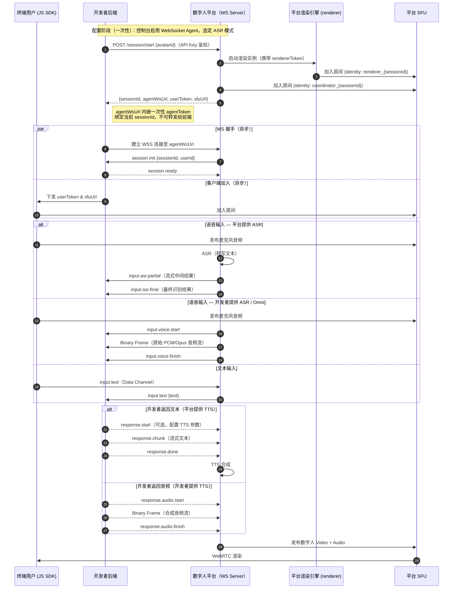
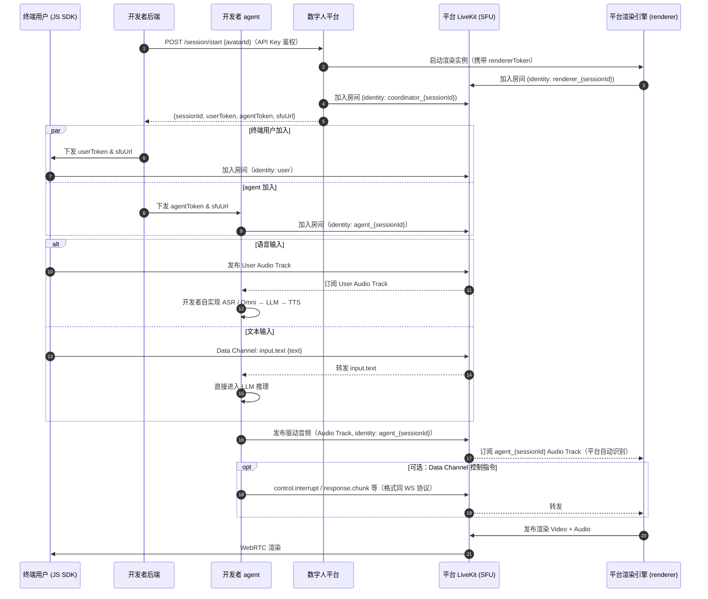
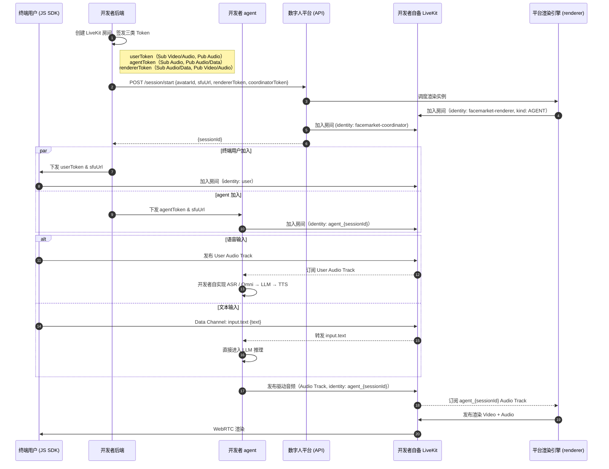

[中文]() | [English](./Live%20Avatar%20Integration%20Guide.md)

# 一、Quick Start（5 分钟跑通数字人）

> 全托管模式下，平台接管 ASR → LLM → TTS 全链路，你只需在控制台配置提示词，后端一个接口换 token，前端几行代码即可让数字人开口说话。

> 💡 **已有 API Key 和 avatar ID？** 跳过 Step 1–2 —— 这些是一次性配置。直接前往 [Step 3](#step-3安装前端-sdk)。

## Step 1：获取 API Key

登录控制台 → 进入「API Key 管理」→ 点击「创建 API Key」，复制并妥善保存。

> ⚠️ API Key 只能在**服务端**使用，不可写入前端代码或提交到代码仓库。

## Step 2：控制台创建数字人

登录控制台，完成以下配置后点击**发布**：

- 上传数字人形象（视频 / 人设）
- 填写 System Prompt（数字人的角色定义）
- 可选：配置知识库、技能（Skills）、音色

发布后得到 avatar ID（数字人的唯一标识）。

## Step 3：安装前端 SDK

```bash
npm install @sanseng/liveavatar-js-sdk
```

## Step 4：后端换取 sessionToken

用 API Key 调用 `/auth/session/token`，换取短期会话凭证并下发给前端：

```bash
curl -X POST "https://facemarket.ai/vih/dispatcher/auth/session/token" \
  -H "Authorization: Bearer <API_KEY>" \
  -H "Content-Type: application/json"
```

返回：

```json
{
  "code": 0,
  "data": {
    "token": "eyJ..."
  }
}
```

将 `token`（即 `sessionToken`）下发给前端。

> `sessionToken` 有效期约 2 分钟，每次会话前重新换取。

## Step 5：前端建立连接

前端 SDK 持 `sessionToken` 自动完成会话启动和房间加入：

```ts
import { createClient } from '@sanseng/liveavatar-js-sdk';

const client = createClient({
  connectConfig: {
    type: 'auth',
    config: {
      avatarId: 'your-avatar-id'
      // authToken can be omitted here and set later via client.setAuthToken('...')
    },
  },
  video: {
    containerElement: document.getElementById('avatar')!,
  },
});

client.setAuthToken('jwt-or-business-token');
await client.connect(); // SDK internally calls /session/start and joins the RTC room
```

**到这里，数字人已经可以对话了。** 🎉

---

> **需要接入自己的 LLM / Agent / 业务系统？** 继续阅读下方的进阶模式。

---

# 二、进阶模式选择

如果全托管模式无法满足你的需求，可根据场景选择以下进阶模式：

| # | 模式 | 适合场景 | 接入成本 |
| --- | --- | --- | --- |
| 1 | **WebSocket Agent** | Serverless / 内网环境，需完全控制对话逻辑 | 低 |
| 2 | **平台 RTC** | 自研语音 Agent，追求极低延迟 | 高 |
| 3 | **BYO RTC** | 私有化部署，完全自备 RTC 基础设施 | 极高 |

---

# 三、核心概念速查

> 建议在阅读后续章节前先浏览本节，后续流程图和事件说明中出现的术语均在此定义。

## 身份与凭证

| 概念 | 解释 |
| --- | --- |
| **API key** | 开发者在控制台生成的长期凭证，用于服务端调用平台管理 API。**只能在后端使用，不可暴露给前端。** |
| **Session token** | 短期会话凭证（有效期约 2 分钟），由后端持 API Key 调用 `/auth/session/token` 换取后下发给前端，前端凭此调用 `/session/start` 发起数字人会话。**仅全托管模式使用**——开发者无需深度参与后端，由前端直接发起会话。WebSocket Agent 和 RTC 类模式均由后端直接持 API Key 调用 `/session/start`，不需要此 token。 |
| **User token** | 前端用户加入 RTC 房间的凭证，由平台签发（BYO RTC 模式下由开发者签发），内嵌房间名和用户身份。 |
| **Agent token** | 开发者 agent 加入 RTC 房间的凭证（仅 WebRTC 模式）。 |
| **Renderer token** | renderer 加入开发者 LiveKit 房间的凭证（仅 BYO RTC 模式，由开发者签发给平台）。 |
| **Coordinator token** | coordinator 加入开发者 LiveKit 房间的凭证（仅 BYO RTC 模式，由开发者签发给平台）。 |
| **Agent WS URL** | WebSocket Agent 模式下平台动态分配的 WebSocket 地址，内嵌一次性 token，仅供开发者**后端**连接，不可下发前端。 |

## 会话与房间

| 概念 | 解释 |
| --- | --- |
| **Room（房间）** | 一次完整交互上下文（一场会话、一次通话），承载所有参与者的音视频流转。`/session/start` 不传 `roomId` 时平台自动创建；多虚拟人场景下多个 Session 共享同一 Room。 |
| **Session（会话）** | 一个虚拟人服务实例的生命周期，从调用 `/session/start` 到连接断开。每次调用返回唯一 `sessionId` 和所属 `roomId`。 |
| **SFU** | 媒体转发服务器（本平台使用 LiveKit），负责在房间内各参与者之间路由音视频流，无需端对端直连。 |

## 参与者角色

| 角色 | Identity 格式 | 说明 |
| --- | --- | --- |
| **user** | `user` | 终端用户，发布麦克风/摄像头，接收数字人画面。同一 Room 可有多个。 |
| **coordinator** | `coordinator_{sessionId}` | 平台对话流协调者，所有模式下必须加入房间。负责语音识别、状态同步，TTS 音频经 gRPC 直送 renderer。 |
| **agent** | `agent_{sessionId}` | 开发者 AI 实体，Platform RTC 模式下在房间内订阅用户媒体、运行推理、发布驱动音频。 |
| **renderer** | `renderer_{sessionId}` | 平台渲染引擎，订阅驱动音频后生成唇形动画，发布 Video+Audio Track。**开发者无需关心。** |

## 技术缩写

| 缩写 | 全称 | 作用 |
| --- | --- | --- |
| **ASR** | Automatic Speech Recognition | 语音转文字 |
| **TTS** | Text-to-Speech | 文字转语音，驱动数字人说话 |
| **VAD** | Voice Activity Detection | 检测用户是否在说话（开口/停止），用于触发打断逻辑 |
| **Data Channel** | LiveKit Data Channel | RTC 房间内的低延迟文本通道，用于传递控制指令和文本事件，协议格式与 WebSocket 完全相同 |

---

# 四、从后端启动新会话

无论是集成 WebSocket 还是 WebRTC 模式，会话都必须通过服务器到服务器（Server-to-Server）的调用来发起。此步骤负责分配系统资源、初始化渲染引擎，并为各个参与方生成必要的 Token。

**接口：** `POST /v1/session/start`

**地址：** `https://facemarket.ai/vih/dispatcher/v1/session/start`

**认证方式：** `Authorization: Bearer <API_KEY>`

### 请求体

**请求（新会话）**

```bash
curl -X POST "https://facemarket.ai/vih/dispatcher/v1/session/start" \
  -H "Authorization: Bearer <API_KEY>" \
  -H "Content-Type: application/json" \
  -d '{
    "avatarId": "string"
  }'
```

**请求（重连 — 复用已有 session）**

```bash
curl -X POST "https://facemarket.ai/vih/dispatcher/v1/session/start" \
  -H "Authorization: Bearer <API_KEY>" \
  -H "Content-Type: application/json" \
  -d '{
    "avatarId": "string",
    "sessionId": "sess_xxx"
  }'
```

> **`sessionId` 参数说明**：不传 = 创建新 Session + 新 Room；传入 = 复用已有 Session（重连）。平台校验 session 为 `active` 后刷新所有凭证并返回；session 已 `closed` 则返回 403。

**请求（BYO RTC）**

```bash
curl -X POST "https://facemarket.ai/vih/dispatcher/v1/session/start" \
  -H "Authorization: Bearer <API_KEY>" \
  -H "Content-Type: application/json" \
  -d '{
    "avatarId": "string",
    "sessionId": "sess_xxx",
    "agentIdentity": "string",
    "sfuUrl": "string",
    "coordinatorToken": "string",
    "rendererToken": "string"
  }'
```

> BYO RTC 模式下 `sessionId` 同样可选：不传创建新会话，传入则复用已有会话（重连时开发者需重新签发 `rendererToken` 和 `coordinatorToken`）。

### 请求参数

| 参数 | 类型 | 必填 | 描述 |
|------|------|------|------|
| `avatarId` | String | ✅ | 数字人唯一标识 |
| `voiceId` | String | ❌ | 覆盖此 session 的数字人默认语音 |
| `sessionId` | String | ❌ | 传入则复用已有 session（重连），不传则创建新 session |
| `agentIdentity` | String | ✅ BYO RTC | agent 的 identity |
| `sfuUrl` | String | ✅ BYO RTC | 开发者 LiveKit SFU 地址 |
| `coordinatorToken` | String | ✅ BYO RTC | coordinator 加入房间的 Token |
| `rendererToken` | String | ✅ BYO RTC | renderer 加入房间的 Token |

成功响应（200 OK）：

```json
{
  "code": 0,
  "message": "success",
  "data": {
    "sessionId": "sess_xxx",
    "sfuUrl": "wss://facemarket.ai/livekit",
    "userToken": "eyJ...",
    "agentToken": "eyJ...",
    "agentWsUrl": "wss://facemarket.ai/vih/dispatcher/v1/ws/agent?token=..."
  }
}
```

### 响应参数

| 字段 | 类型 | 描述 |
| --- | --- | --- |
| `code` | int | 0 表示成功 |
| `message` | String | 状态信息（如 "success"） |
| `data.sessionId` | String | 当前会话实例的唯一标识符 |
| `data.sfuUrl` | String | 供 JS SDK 或 Agent 加入的 LiveKit SFU 终结点地址 |
| `data.userToken` | String | 供终端用户（前端）加入房间的 Token |
| `data.agentToken` | String | （仅 Platform RTC 模式）供 Agent 加入房间的 Token |
| `data.agentWsUrl` | String | （仅 WebSocket Agent 模式）供开发者后端连接的 WebSocket 地址 |

标准实现流程：

1. 后端服务调用 `POST /v1/session/start`。
   - **新会话**：仅传 `avatarId`
   - **重连**：传 `avatarId` + `sessionId`
2. 平台服务验证资源权限，并初始化流媒体渲染管道。重连时复用已有 session 和 room。
3. 后端接收响应，**必须**存储 `sessionId` 用于追踪和后续重连，并将 `userToken` + `sfuUrl` 下发至前端。重连时旧凭证被新凭证替换。

### 停止会话

**接口：** `POST /v1/session/stop`

**地址：** `https://facemarket.ai/vih/dispatcher/v1/session/stop`

**认证方式：** `Authorization: Bearer <API_KEY>`

```bash
curl -X POST "https://facemarket.ai/vih/dispatcher/v1/session/stop" \
  -H "Authorization: Bearer <API_KEY>" \
  -H "Content-Type: application/json" \
  -d '{
    "sessionId": "sess_xxx"
  }'
```

成功响应（200 OK）：

```json
{
  "code": 0,
  "message": "success"
}
```

你也可以通过 WebSocket 或 Data Channel 发送 `session.stop` 事件来停止会话，或直接断开 RTC 房间连接。

---

现在你可以在前端启动数字人：

```ts
import { createClient } from '@sanseng/liveavatar-js-sdk';

const client = createClient({
  connectConfig: {
    type: 'direct',
    config: {
      sfuUrl: 'wss://your-livekit-host',
      userToken: 'your-room-token',
    },
  },
  video: {
    containerElement: document.getElementById('avatar')!,
  },
});
await client.connect();
```

# 五、WebSocket Agent 模式

WebSocket Agent 模式下，**平台持有 WS Server，为每次会话动态分配一个 WS 端点（`agentWsUrl`），开发者后端主动连接平台**。开发者完全控制对话逻辑（LLM / Agent / 业务系统），平台负责 RTC 音视频和数字人渲染。无需公网服务器。



---

## 5.1 WebSocket 协议速查

> 完整协议定义见 [PROTOCOL](PROTOCOL.md)，本节列出核心事件。

所有文本消息使用三段式事件命名：`<domain>.<action>[.<stage>]`

### 平台 → 开发者（下行事件）

| 事件 | 触发时机 |
| --- | --- |
| `session.init` | WS 连接建立后，平台**始终**主动发送 |
| `input.text` | 用户通过 Data Channel 发送文本，平台转发 |
| `input.asr.partial` | ASR 流式中间结果（平台提供 ASR 时，由平台发送） |
| `input.asr.final` | ASR 最终识别结果（平台提供 ASR 时，由平台发送） |
| `input.voice.start` | VAD 检测到用户开始说话 |
| `input.voice.finish` | VAD 检测到用户停止说话 |
| `session.state` | 状态同步（IDLE / LISTENING / THINKING / SPEAKING 等） |
| `system.idleTrigger` | 用户长时间无操作 |
| `session.closing` | 连接即将关闭（如超时） |

### 开发者 → 平台（上行事件）

| 事件 | 说明 |
| --- | --- |
| `session.ready` | 握手响应，收到 `session.init` 后**必须**回复 |
| `response.start` | 可选，配置本次回复的 TTS 参数（speed / volume / mood）；仅在**平台提供 TTS** 时有效 |
| `response.chunk` | 流式文本回复分片；平台提供 TTS 时使用 |
| `response.done` | 文本回复结束标志；平台提供 TTS 时使用 |
| `response.audio.start` | 音频流开始；**谁提供 TTS 谁发送**（开发者提供 TTS 时由开发者发送，平台提供 TTS 时由平台发送） |
| `response.audio.finish` | 音频流结束；**谁提供 TTS 谁发送**（同上） |
| `control.interrupt` | 打断当前数字人播报 |
| `system.prompt` | 空闲唤起文本（触发数字人主动说话） |
| `session.stop` | 请求结束当前会话 |
| `error` | 错误上报 |

### 音频传输（Binary Frame）

音频数据通过 **WebSocket 二进制帧**传输，不使用 base64。每帧格式：

```plain
| Header (9 bytes) | Audio Payload (PCM / Opus) |
```

Binary Frame 同时用于两条路径，格式完全相同，仅方向相反：

- `input.voice.*`（双向）：谁提供 ASR 谁发送——开发者提供 ASR 时由开发者推送；平台提供 ASR 时由平台推送
- `response.audio.*`（双向）：谁提供 TTS 谁发送——开发者提供 TTS 时由开发者推送合成音频；平台提供 TTS 时由平台推送

完整 Header 字段定义见 [PROTOCOL](PROTOCOL.md)。

### Java SDK

我们提供了 WebSocket 协议的 Java SDK，封装了握手、事件解析和 Binary Frame 处理：

[https://github.com/newportAI-lab/liveavatar-channel](https://github.com/newportAI-lab/liveavatar-channel)

### Python SDK

我们提供了 WebSocket 协议的 Python SDK，封装了握手、事件解析和 Binary Frame 处理：

[https://github.com/newportAI-lab/liveavatar-channel-python](https://github.com/newportAI-lab/liveavatar-channel-python)

---

# 六、WebRTC 接入模式

WebRTC 模式下，开发者自行实现 **agent**，直接在 RTC 房间内订阅用户音频、运行 AI 推理、发布驱动音频。**平台不参与 AI 推理链路**，仅负责订阅 agent 的音频并渲染数字人。

两种子模式的区别在于 **LiveKit SFU 归属方**不同：

|  | 平台 RTC | BYO RTC |
| --- | --- | --- |
| LiveKit 归属 | 平台 | 开发者 |
| Token 签发方 | 平台 | 开发者 |
| 适合场景 | AI Agent 自研，快速集成 | 私有化部署，完全自备 RTC |

---

## 6.1 平台 RTC（平台持有 LiveKit）

平台持有 LiveKit SFU，开发者实现 agent 后，以 `agent_{sessionId}` 身份加入房间。**平台自动订阅该 identity 下的 Audio Track 来驱动数字人口型**，开发者无需额外配置。



**Identity 与权限约定**

| 角色 | Identity 格式 | LiveKit 权限 |
| --- | --- | --- |
| 终端用户 | `user` | 订阅 Video/Audio；发布 Audio |
| agent | `agent_{sessionId}` | 订阅 Audio；发布 Audio、Data |
| renderer | `renderer_{sessionId}` | 订阅 Audio/Data；发布 Video/Audio（平台内部管理） |

⚠️ agent 的 identity **必须**以 `agent_` 开头，平台依此自动订阅驱动音频。

**适用场景**：AI 开发者自研语音 Agent、私有知识库问答、需要完全掌控对话逻辑。

### Python SDK

我们提供了 Platform RTC 模式的 Python SDK，封装了 LiveKit 房间加入、音频轨道订阅/发布和 Data Channel 通信：

[https://github.com/newportAI-lab/liveavatar-platform-rtc-python](https://github.com/newportAI-lab/liveavatar-platform-rtc-python)

---

## 6.2 BYO RTC（开发者自备 LiveKit）

平台定位从"全托管服务商"变为**"数字人渲染插件"**。媒体流完全在开发者的 SFU 内部流转，平台 renderer 以参与者身份加入开发者的 LiveKit 房间。Token 签发权完全归属开发者。



**Token 签发说明**

| 角色 | Identity | Token 签发方 | 网络要求 |
| --- | --- | --- | --- |
| 终端用户 | `user` | 开发者后端 | 内网即可 |
| agent | `agent_{sessionId}` | 开发者后端 | 内网即可 |
| renderer | `facemarket-renderer` | Plugin 自动签发（直接调用 API 时由开发者后端签发） | 开发者 LiveKit 需公网可达 |
| coordinator | `facemarket-coordinator` | Plugin 自动签发（直接调用 API 时由开发者后端签发） | 开发者 LiveKit 需公网可达 |

> **安全提示**：`rendererToken` 应设为最小权限（仅 Sub Audio/Data + Pub Video/Audio），`coordinatorToken` 应设为 `canPublish: false, canPublishData: true`。有效期均不超过 1 小时，通过 `/session/start` 一次性传递，**平台不保存**。
>
> **约束**：BYO RTC 使用固定 identity，**同一 Room 内同时只能存在一个虚拟人实例**。如需多虚拟人，请使用平台 RTC。

**适用场景**：企业私有化部署、已有完整 RTC 基础设施、极致低延迟要求。

---

# 七、前端 SDK 文档

前端接入代码示例见第一章 Quick Start Step 5。

JS SDK 提供更丰富的能力（字幕回调、情绪控制、打断监听、连接状态管理等），完整 API 文档见：[https://github.com/newportAI-lab/liveavatar-js-sdk](https://github.com/newportAI-lab/liveavatar-js-sdk)

---

# 八、使用沙箱环境测试

我们提供每月 30 分钟的免费测试额度，需在沙箱环境中运行。沙箱与生产环境使用相同的协议，可用于完整流程验证。

让会话路由到沙箱，需传递 `X-Env-Sandbox: true` header。具体方式取决于谁调用 `/session/start`：

## 后端直接调用 /session/start

在服务端请求中增加 header：

```bash
curl -X POST "https://facemarket.ai/vih/dispatcher/v1/session/start" \
  -H "Authorization: Bearer <API_KEY>" \
  -H "Content-Type: application/json" \
  -H "X-Env-Sandbox: true" \
  -d '{
    "avatarId": "string"
  }'
```

## 前端 SDK 调用 /session/start（auth 模式）

在客户端配置中设置 `sandbox: true`，SDK 会自动为所有 HTTP 请求添加 `X-Env-Sandbox: true`：

```ts
import { createClient } from '@sanseng/liveavatar-js-sdk';

const client = createClient({
  connectConfig: {
    type: 'auth',
    config: { avatarId: 'demo-avatar' },
  },
  http: {
    baseURL: 'https://facemarket.ai/vih/dispatcher',
    headers: { /* custom static headers */ },
  },
  sandbox: true,
});
```

自定义 `http.headers` 会在启用沙箱时与沙箱 header 合并，一起发送到每个请求。

---

# 九、FAQ

## 常见错误码

错误分为两类：**系统错误**（临时基础设施问题 — 重试即可）和**可操作错误**（由你的账户状态或请求引起 — 错误信息会告诉你如何修复）。

### 系统错误（可重试）

以下错误表示平台侧临时资源紧张，无需你做任何操作，重试即可：

| 错误码 | 标识符 | 含义 | 面向用户提示 |
|--------|--------|------|-------------|
| 40001 | `NO_ORCHESTRATION_POD` | 调度层暂时满载，属于临时性基础设施状态 | `服务暂时不可用，请稍后重试。` |
| 40002 | `NO_RENDERER_POD` | 渲染层暂时满载，用户体验同 40001 | 同 40001 |
| 40003 | `SESSION_START_FAILED` | 因内部处理错误导致会话初始化失败 | `启动数字人失败，请重试。` |

> 对于 40001 和 40002，以 2–3 秒退避重试。如果超过 3 次仍然失败，提示用户等待更长时间或联系技术支持。

### 可操作错误（需修复）

以下错误表示你的账户、配置或请求存在问题。请仔细阅读错误信息：

| 错误码 | 标识符 | 含义 | 面向用户提示 |
|--------|--------|------|-------------|
| 40004 | `PRINCIPAL_UNIDENTIFIED` | 请求中的 API Key 或凭证无法映射到有效账户，通常意味着 Key 缺失、格式错误或已被停用 | `无法识别你的账户，请检查 API Key 或联系管理员。` |
| 40005 | `CONCURRENCY_LIMIT_EXCEEDED` | 已达到当前订阅计划允许的最大并发会话数 | `已达最大并发会话数，请关闭活跃会话后重试，或升级套餐。` |
| 40006 | `QUOTA_EXHAUSTED` | 当前计划的时间或额度已用完，可能是月度分钟数、一次性试用额度或预付余额 | `使用额度已用尽，请充值或升级套餐。` |
| 40007 | `SESSION_ACCESS_DENIED` | 尝试访问属于其他账户的 session，这是一个授权边界——你只能操作自己凭证创建的会话 | `访问被拒绝：你无权访问此会话，请检查 session ID 后重试。` |

### 处理建议

| 场景 | 建议 |
|------|------|
| 40001 / 40002 持续出现 | 最多重试 3 次，每次间隔 2–3 秒。如果仍然失败，显示提示信息并提供"联系技术支持"链接 |
| 40003 | 重试一次。如果持续出现，检查控制台中数字人配置（素材有效性、发布状态） |
| 40004 | 验证 `Authorization: Bearer <API_KEY>` header 是否存在且 Key 在控制台为活跃状态。如果 Key 有效，请联系账户管理员 |
| 40005 | 通过控制台或 API 关闭未使用的会话，或升级套餐获取更多并发槽位 |
| 40006 | 在控制台查看用量面板，充值或升级到更高额度的套餐 |
| 40007 | 验证请求中的 `sessionId` 属于你的账户。如果是重连操作，请确认存储的是原始 `/session/start` 响应中的正确 `sessionId` |

---

## Token 与认证

### Q: sessionToken 有效期多长？

2 分钟。它设计为一次性交换使用——你的后端调用 `/auth/session/token`，下发给前端，前端立即调用 `/session/start`。不要缓存或重复使用 sessionToken。

### Q: sessionToken 过期后会怎样？

`/session/start` 调用返回 `401 Unauthorized`。前端应向你的后端请求新 token 并重试。在 JS SDK（auth 模式）中，SDK 会将此作为连接错误抛出——监听 `error` 事件并从那里刷新 token。

### Q: 能否不经过后端直接刷新 sessionToken？

不能。token 交换需要你的 API Key，而 API Key 绝不能暴露给前端。刷新操作必须始终经由你的后端。

### Q: 如何轮换已泄露的 API Key？

1. 登录控制台 →「API Key 管理」
2. 对已泄露的 Key 点击**停用**。所有由该 Key 签发的 token 在下一次 `/session/start` 调用时将失效
3. 点击**创建 API Key** 生成新 Key
4. 更新后端配置中的新 Key

### Q: 停用 API Key 会终止活跃会话吗？

不会。活跃会话绑定的是会话凭证而非签发 API Key。停用操作只会阻止后续使用已停用 Key 发起的 `/auth/session/token` 和 `/session/start` 调用。

---

## 会话生命周期

### Q: 一个会话能持续多久？

没有固定的最大时长。只要连接保持且音视频在传输，会话就保持活跃。空闲会话（无用户交互）可能在平台配置的超时后被关闭——请在控制台检查你的数字人设置。

### Q: 如何结束会话？

三种方式：

1. **REST API**：`POST /v1/session/stop`，参数 `{ "sessionId": "sess_xxx" }`（使用 API Key 认证，基础 URL 同 `/session/start`）
2. **Data Channel / WebSocket**：从 agent 或前端发送 `session.stop` 事件
3. **连接驱动**：断开 RTC 房间或 WebSocket 连接也会触发会话终止

### Q: 收到 session.closing 后应该做什么？

1. 停止向平台发送新事件或音频帧
2. 从你这边关闭 WebSocket 连接
3. 不要尝试用相同的 `sessionId` 重连——正在关闭的会话无法复用。调用 `/session/start`（不传 `sessionId`）创建新会话

### Q: 断开后能复用 sessionId 吗？

仅当会话仍处于 `active` 状态时可以。调用 `/session/start` 并传入 `sessionId` 进行重连。如果会话已关闭（超时、空闲、主动断开），API 会返回 `403`——此时应创建新会话。

### Q: 什么会触发空闲唤醒事件？

平台的会话状态机监控用户交互。当用户处于非活跃状态且会话进入空闲状态达到配置时长时，平台触发 `system.idleTrigger`。你的 agent 可通过 `system.prompt` 主动发送消息进行回应。

---

## 重连与恢复

### Q: 网络断开后如何重连？

调用 `POST /v1/session/start`，参数 `{ "avatarId": "...", "sessionId": "sess_xxx" }`。平台验证会话仍为 `active` 后返回新凭证（`userToken`、`sfuUrl` 等）。使用这些新凭证重新加入——不要复用旧 token。

### Q: 重连后旧 token 会怎样？

旧 token 立即失效。所有参与者必须使用重连响应中的新 token。

### Q: 尝试重连时发现会话已关闭怎么办？

API 返回 `403 Forbidden`。会话可能因空闲超时、主动停止或内部错误而关闭。调用 `/session/start`（不传 `sessionId`）创建新会话。

### Q: 前端 SDK 会自动重连吗？

自动重连在 SDK 路线图中，计划在后续版本发布。当前版本中，你应监听连接状态事件并实现自己的重试逻辑——调用后端重新执行 `/session/start`（传入已有 `sessionId`），然后通过 `client.connect()` 将新凭证传递给 SDK。

### Q: WebSocket Agent 模式下 WS 连接断开怎么办？

调用 `/session/start` 并传入 `sessionId` 获取新的 `agentWsUrl`，然后重新连接。确保你的后端能够处理重复的 `session.init`（检查 `sessionId` 是否已活跃并回复 `session.ready`）。

---

## 沙箱 vs 生产环境

### Q: 沙箱环境有哪些限制？

| 资源 | 沙箱限制 |
|------|---------|
| 月度用量 | 30 免费分钟 |
| 并发会话 | 1 |
| 数字人素材 | 仅限沙箱创建的数字人 |

生产环境根据订阅等级享有更高或无限制配额。

### Q: 沙箱和生产环境有功能差异吗？

没有。沙箱使用与生产环境相同的协议、端点和渲染管道。唯一区别是配额限制。这意味着你可以在沙箱中开发和测试完整集成，然后零代码改动切换到生产环境。

### Q: 如何从沙箱切换到生产环境？

移除后端请求中的 `X-Env-Sandbox: true` header，或在前端 SDK 配置中设置 `sandbox: false`（或直接省略）。就这些——基础 URL 和所有 API 合约完全相同。

### Q: 如何查看沙箱剩余配额？

登录控制台 → 进入用量面板。沙箱部分会显示当前计费周期内的剩余分钟数。

---

## WebSocket 集成

### Q: 为什么不能把 agentWsUrl 分享给前端？

`agentWsUrl` 内嵌了一个绑定到当前 `sessionId` 的一次性 token。如果暴露给前端：

- 恶意客户端可用该 token 冒充你的 agent 并注入对话内容
- token 为一次性使用——前端消耗后你的后端就无法连接了

始终将 `agentWsUrl` 保留在后端。

### Q: 二进制音频帧的字节序是什么？

所有二进制帧 header 字段使用**网络字节序（大端序）**。音频负载格式（PCM 或 Opus）在会话配置阶段协商——请在控制台检查你的数字人设置。

### Q: 同一会话中能混用文本和音频回复吗？

可以。协议支持随时在 `response.chunk`（文本 → 平台 TTS）和 `response.audio.*`（开发者提供音频）之间切换。平台会无缝处理过渡。

### Q: 如果发送了格式错误的 JSON 文本消息会怎样？

平台会以 `1002`（协议错误）关闭 WebSocket 连接。请确保 JSON 格式正确且符合协议参考中定义的事件 schema。

---

## WebRTC 集成

### Q: agent 使用了错误的 identity 前缀会怎样？

平台的 renderer 自动订阅 `agent_{sessionId}` 身份发布的音频轨道。如果你的 agent 使用了不同的 identity，renderer 将无法获取驱动音频——数字人看起来是静音的，尽管其他一切连接正常。始终将 agent identity 格式化为 `agent_{sessionId}`。

### Q: BYO RTC 模式下 renderer 无法加入我的 LiveKit 房间，如何排查？

1. 确认你的 `sfuUrl` 可从公网访问
2. 确认 `rendererToken` 未过期且包含正确的房间名称
3. 检查 token 授予了 `canPublish: true` 和 `canSubscribe: true`（音频和视频均需）
4. 确保 LiveKit 服务器的 `rtc_config.tcp_port`（默认 7881）和 `rtc_config.udp_port` 范围对入站流量开放
5. 联系技术支持并提供 session ID 和失败加入的近似时间戳

### Q: BYO RTC 模式下需要我管理 renderer 的生命周期吗？

不需要。平台通过 `/session/start` 和 `/session/stop` API 管理 renderer 的启动和关闭。你只需要签发有效的 token 并保持 LiveKit 房间可访问。

### Q: 同一房间内可以有多个 agent 吗？

Platform RTC 模式下，每个 session 只有一个 `agent_{sessionId}` identity。如需多个 agent 实例，可在同一房间内创建多个 session（每次 `/session/start` 调用传入相同的 `roomId`）。每个 agent 使用各自的 session-scoped identity 加入。请注意每个 session 消耗一个并发槽位。

---

## 故障排查

### Q: API 返回成功但看到黑屏，该检查什么？

按以下步骤逐一排查：

1. **凭证**：确认前端收到了有效的 `userToken` 和 `sfuUrl`
2. **网络**：验证客户端能在 443 端口访问 `sfuUrl`——企业防火墙或 VPN 可能阻断 WebRTC 流量
3. **浏览器**：确保使用的是支持 WebRTC 的浏览器（见下方浏览器支持表）
4. **控制台日志**：打开浏览器 DevTools → Console，查看 LiveKit 连接错误或 SDK 警告
5. **会话状态**：检查 `/session/start` 是否返回了有效的 `sessionId` 且你的后端已正确存储

### Q: 有声音但数字人口型不动，为什么？

通常意味着 renderer 没有收到驱动音频轨道。常见原因：

- **WebSocket 模式**：确认你的 `response.chunk` / `response.audio.*` 事件按正确顺序发送（`response.start` → `response.chunk` → `response.done` 或 `response.audio.start` → binary frames → `response.audio.finish`）
- **WebRTC 模式**：确认 agent 以 `agent_{sessionId}` 身份发布音频且轨道未被静音
- **音频格式**：确保音频格式（采样率、编码）与数字人配置匹配

### Q: 数字人回应慢，如何优化？

延迟会在整个管道中累积。逐一检查各阶段：

1. **网络**：尽量缩短后端与平台服务器的物理距离。WebSocket 模式下将 agent 部署在靠近平台区域的节点
2. **LLM**：使用流式响应。一旦首个 token 到达就发送 `response.chunk`——不要等待完整回复
3. **TTS**：如果使用平台 TTS，流式合成在首个 `response.chunk` 时即开始。更早发送文本意味着更早开始生成音频
4. **SDK 缓冲**：JS SDK 维护一个小型抖动缓冲以保证平滑播放，当前版本不可配置

### Q: 支持哪些浏览器？

| 浏览器 | 最低版本 | 状态 |
|--------|---------|------|
| Chrome | 90+ | 支持 |
| Edge | 90+ | 支持 |
| Firefox | 90+ | 支持 |
| Chrome for Android | 90+ | 支持 |
| Safari | 15+ | 支持 |
| Mobile Safari (iOS) | 15+ | 支持 |

需要 WebRTC。隐私/无痕模式下的浏览器可能对 WebRTC 支持有限——请先在正常模式下测试。

---

## 联系技术支持

### Q: 报告问题时应提供哪些信息？

提前提供以下信息将显著加快排查速度：

| 信息项 | 为何有帮助 |
|--------|-----------|
| `sessionId` | 精确定位到具体会话及所有相关日志 |
| 近似的 UTC 时间戳 | 跨分布式系统关联事件 |
| 错误码（如 40005） | 立即缩小根因范围 |
| 集成模式 | 告知需排查的管道（全托管 / WebSocket Agent / Platform RTC / BYO RTC） |
| `avatarId` | 关联到你的具体数字人配置 |
| 客户端日志 | 浏览器控制台输出或 SDK 错误事件 |
| 网络拓扑（BYO RTC） | LiveKit 服务器区域及前方的代理/CDN |

### Q: 如何联系技术支持？

- **邮件**：将详情发送至 [techsupport@newportai.com](mailto:techsupport@newportai.com)
- **GitHub Issues**：在 [liveavatar-integration-guide/issues](https://github.com/newportAI-lab/liveavatar-integration-guide/issues) 提交集成问题和功能建议
