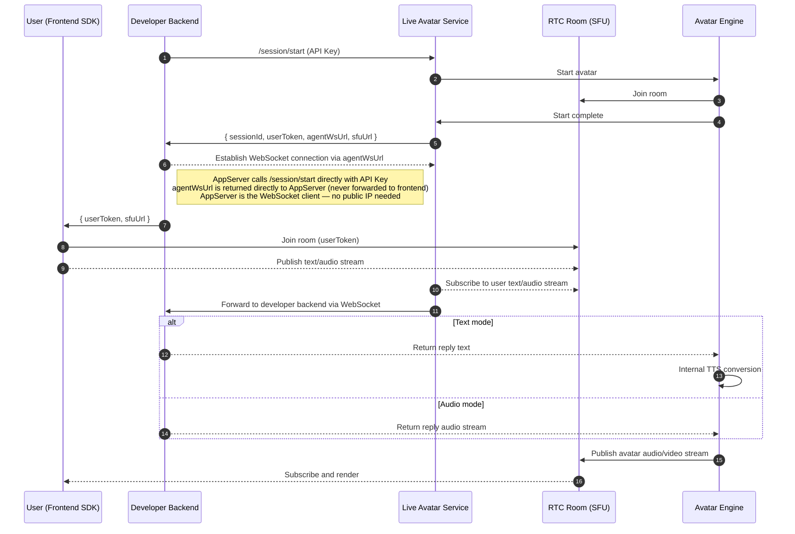
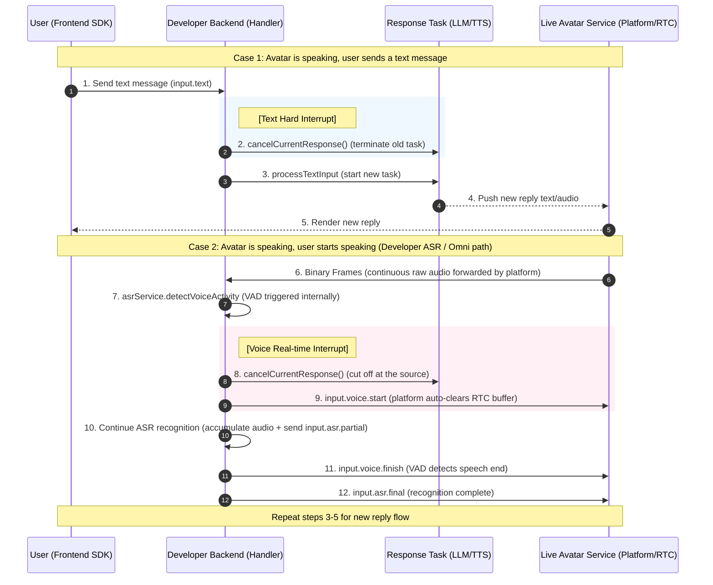

# Protocol Overview

This protocol defines the WebSocket communication between the Live Avatar platform (coordinator) and developer services (agent), covering text, audio, and image content.

## Design Goals

1. Semantic message type naming for ease of understanding.
2. Streaming data transmission support.
3. Out-of-order resilience.
4. Extensible to multi-session scenarios.

## Text Message Type Naming Conventions

We use the term "event" to designate message types. To prevent confusion as the number of message types grows, a specific set of conventions has been established.

### Three-Part Semantic Structure

```
<domain>.<action>[.<stage>]
```

#### 1️⃣ Layer 1: Domain (Category)

| Domain | Meaning |
| --- | --- |
| session | Session lifecycle |
| input | User input |
| response | Model output |
| control | Control signals |
| system | System behavior |
| error | Error |
| tool (future) | Tool calls |

---

#### 2️⃣ Layer 2: Action

Describes "what is being done"

| Action | Example |
| --- | --- |
| init | session.init |
| ready | session.ready |
| text | input.text |
| asr | input.asr |
| chunk | response.chunk |
| done | response.done |
| interrupt | control.interrupt |
| prompt | system.prompt |
| idleTrigger | system.idleTrigger |

---

#### 3️⃣ Layer 3: Stage (Optional)

Used for "streaming / state"

| Stage | Example |
| --- | --- |
| partial | input.asr.partial |
| final | input.asr.final |
| chunk | response.chunk |
| done | response.done |
| cancel | response.cancel |

---

# Text Protocol Design

## WebSocket Connection Model

The Live Avatar platform provides the WebSocket server and dynamically allocates a WS endpoint (`agentWsUrl`) for each session. The developer backend connects to the platform as a WebSocket client. No public-facing server is required on the developer side.



> **sessionToken**
>
> `sessionToken` (obtained via `/auth/session/token`) is only used in fully managed mode, where the **frontend** calls `/session/start` directly and the backend acts as a token relay — keeping the API Key off the client while avoiding deep backend involvement.
>
> In WebSocket Agent and RTC modes, the **developer backend** calls `/session/start` directly with an API Key and receives `userToken + sfuUrl` to distribute to the frontend. A `sessionToken` is **not required**.

---

## Scenario 1: WebSocket Full Flow (Standard Path)

### 1️⃣ Establishing Connection

#### Live Avatar Service → Developer Backend

> The Live Avatar Service **always** sends `session.init` first after the WebSocket connection is established.

```json
{
  "event": "session.init",
  "data": {
    "sessionId": "sess_123",
    "userId": "u_1"
  }
}
```

---

#### Developer Backend → Live Avatar Service

```json
{
  "event": "session.ready"
}
```

---

#### Live Avatar Service → Developer Backend (scene.ready forwarded)

After the user's frontend joins the LiveKit room and the avatar scene renders, the user sends `scene.ready` via Data Channel. The coordinator bridges this to the agent via WebSocket so the agent knows it can begin the conversation.

```json
{
  "event": "scene.ready"
}
```

> This is a one-way notification. The agent does not reply to it.

---

### 2️⃣ Heartbeat

Relies on standard WebSocket protocol control frames.

Adheres to the standard WebSocket protocol (RFC 6455):

- **Ping (0x9)**: The server may send Ping frames to the client.
- **Pong (0xA)**: Upon receiving a Ping frame, the client must automatically reply with a Pong frame.

---

### 3️⃣ User Text Input

The Live Avatar Service sends a text input message.

```json
{
  "event": "input.text",
  "requestId": "req_1",
  "data": {
    "text": "What is your name?"
  }
}
```

---

### 4️⃣ Developer Service Streaming Output

#### start (Optional)

Sent by the Developer Service **before** the first `response.chunk`. Use this to configure the TTS engine managed by the Live Avatar Service (speed, volume, mood). Omit it to use default settings. If TTS is provided by the developer, this message is also unnecessary.

```json
{
  "event": "response.start",
  "requestId": "req_1",
  "responseId": "res_1",
  "data": {
    "audioConfig": {
      "speed": 1.0,
      "volume": 1.0,
      "mood": "neutral"
    }
  }
}
```

**`speed` reference**

| Value | Meaning |
| --- | --- |
| 0.5 | Very slow (suitable for teaching / elderly users) |
| 0.8 | Slightly slow |
| 1.0 | Normal (default) |
| 1.2 | Slightly fast |
| 1.5 | Very fast |
| 2.0 | Maximum speed (clarity not guaranteed) |

**`volume` reference**

| Value | Meaning |
| --- | --- |
| 0.0 | Muted |
| 0.5 | Quiet |
| 1.0 | Standard (default) |
| 1.2 | Loud |
| 1.5 | Maximum (may clip) |

**`mood` values** (extensible): `neutral` · `happy` · `sad` · `angry` · `excited` · `calm` · `serious`

---

#### chunk (Text)

```json
{
  "event": "response.chunk",
  "requestId": "req_1",
  "responseId": "res_1",
  "seq": 12,
  "timestamp": 1710000000000,
  "data": {
    "text": "Hello"
  }
}
```

---

#### done (Text)

```json
{
  "event": "response.done",
  "requestId": "req_1",
  "responseId": "res_1"
}
```

---

requestId → responseId = 1:N

`seq` increments sequentially within a single response.

A single response may consist of replies from multiple agents.

---

### 5️⃣ State Synchronization (Sent by the Live Avatar Service)

```json
{
  "event": "session.state",
  "seq": 12,
  "timestamp": 1710000000000,
  "data": {
    "state": "SPEAKING"
  }
}
```

`seq` increments sequentially within a single session. All `state` values (subject to future expansion):

| **State** | **Speaker** | **System Behavior** |
| --- | --- | --- |
| **IDLE** | None | Awaiting input |
| **LISTENING** | User | ASR input capture |
| **THINKING** | System (Mind) | LLM/TTS preparation |
| **STAGING** | System (Body) | Preparing Live Avatar generation |
| **SPEAKING** | System (Body) | Live Avatar: normal response output |
| **PROMPT_THINKING** | System (Mind) | Preparing reminder script |
| **PROMPT_STAGING** | System (Body) | Preparing to generate Live Avatar |
| **PROMPT_SPEAKING** | System (Body) | Live Avatar: broadcasting reminder audio |

---

### 6️⃣ Interrupt (Sent by Developer Service)

```json
{
  "event": "control.interrupt",
  "requestId": "req_2"
}
```

A signal initiated by the Developer Service for **proactive, business-logic-driven** interrupts — for example, stopping the avatar for a custom reason independent of user input.

> **Note:** `control.interrupt` is **not** required for input-driven flows. When the platform processes `input.text` or receives `input.voice.start`, it automatically clears the RTC buffer internally. Use `control.interrupt` only when your application logic needs to stop the avatar outside of a user input event.

Providing `requestId` helps ensure that a specific, designated conversation is interrupted precisely, preventing erroneous interruptions caused by network instability. This field is optional.

The following sequence diagram illustrates the interrupt execution flow.

> **Interrupt Ownership Rule — tied to ASR ownership:**
> The party that provides ASR is the only one authorized to issue `control.interrupt`.
>
> | ASR Mode | Who may send `control.interrupt` | Platform auto-interrupt |
> |---|---|---|
> | Platform ASR (Scenario 2A) | Developer **and** Platform | Allowed — platform may auto-interrupt based on its own VAD policy |
> | Developer ASR / Omni (Scenario 2B) | Developer **only** | **Forbidden** — platform MUST NOT send `control.interrupt` |
>
> **Rationale:** In Scenario 2B the developer owns VAD, so only the developer knows when speech boundaries occur. A platform-initiated interrupt in this mode would break the developer's ASR pipeline.
>
> **Note:** Voice interrupt handling differs by ASR mode:
>
> - **Platform ASR** — The platform detects VAD and sends `input.voice.start` to the developer. The platform may also auto-interrupt based on its own VAD policy.
> - **Developer ASR / Omni** — The developer receives raw audio Binary Frames (Scenario 2B), runs VAD internally, and sends `input.voice.start` to the platform. The platform automatically clears the RTC buffer upon receiving `input.voice.start`. This is the path illustrated in the diagram below.



---

### 7️⃣ Connection Imminently Closing (Sent by the Live Avatar Service)

```json
{
  "event": "session.closing",
  "data": {
    "reason": "timeout"
  }
}
```

This message is typically sent proactively by the system just before a timeout is declared.

---

## Scenario 2: Real-time Voice Input

> **Design Principle — ASR Ownership:**
> Whoever provides ASR is responsible for producing ASR recognition results and VAD judgments.
>
> - **Platform ASR** → Platform runs ASR + VAD internally. The recognized text is sent to the agent WebSocket as `input.text` (same format as typed text in Scenario 1). `input.asr.*` / `input.voice.*` events are internal to the platform and are **not** forwarded to the agent WebSocket.
> - **Developer ASR / Omni** → Platform forwards raw audio Binary Frames to the Developer Service; the developer runs ASR + VAD and sends `input.asr.*` / `input.voice.*` **to the platform** to keep its state machine in sync and enable conversation logging. `input.asr.*` / `input.voice.*` events are **only** used in this path.

---

### Scenario 2A: Platform ASR

In this mode, the platform performs ASR and VAD internally. The recognized text is sent to the agent WebSocket as `input.text` — the same event used for typed text in Scenario 1. The developer processes it identically to a text message.

`input.asr.*` and `input.voice.*` events are internal to the platform and are **not** forwarded to the agent WebSocket. They exist only for the Developer ASR path (Scenario 2B), where the developer sends them to the platform.

👉 The workflow is identical to Scenario 1 — the agent receives `input.text` and responds with standard response events.

---

### Scenario 2B: Developer ASR / Omni

When the avatar is configured for developer-provided ASR (including Omni multimodal models), the **Live Avatar Service (Platform) → Developer Service** continuously forwards the user's audio as a raw Binary Frame stream throughout the session. There are no start/finish signaling events — the platform performs no VAD and imposes no segmentation.

#### Continuous Raw Audio Stream

Binary Frames are forwarded using the same binary format defined in the [Audio Protocol](#audio-protocol-design-websocket-channel-only) section.

> The raw audio Binary Frame format is identical to the `response.audio.*` Binary Frame format used for developer-managed TTS output — only the transmission direction is reversed.

The developer runs VAD and ASR internally, then sends the **`input.voice.*` and `input.asr.*` events to the platform**:

| Event | Direction | Purpose |
|---|---|---|
| `input.voice.start` | **Developer → Platform** | Notify platform that user started speaking; triggers LISTENING state |
| `input.asr.partial` | **Developer → Platform** | Stream partial recognition results for real-time display |
| `input.voice.finish` | **Developer → Platform** | Notify platform that user stopped speaking |
| `input.asr.final` | **Developer → Platform** | Send final recognition result; platform advances state machine |

After sending `input.asr.final`, the developer processes the recognized text and responds using the standard response events (Scenario 1, Section 4).

---

### Speech Output Start / End Detection (The party providing TTS is responsible for sending these messages)

#### Speech Output Started

```json
{
  "event": "response.audio.start",
  "requestId": "req_1",
  "responseId": "res_1"
}
```

#### Speech Output Finished

```json
{
  "event": "response.audio.finish",
  "requestId": "req_1",
  "responseId": "res_1"
}
```

**Scenario: TTS provided by the Developer Service**

After sending the "Speech Output Started" message, the developer service pushes the corresponding audio data. Once the audio data transmission is complete, the "Speech Output Finished" message is sent.

**Scenario: TTS provided by the Live Avatar Service**

After sending the "Speech Output Started" message, the Live Avatar Service pushes the corresponding audio data. Once the audio data transmission is complete, the "Speech Output Finished" message is sent.

---

## Scenario 3: Server-Initiated Interaction (Idle Wake-up)

### 1️⃣ Idle Event (Sent by the Live Avatar Service)

```json
{
  "event": "system.idleTrigger",
  "data": {
    "reason": "user_idle",
    "idleTimeMs": 120000
  }
}
```

The system detected that the Live Avatar has been idle for a significant period.

### 2️⃣ Idle Prompt Text Message (Sent by the Developer Service)

```json
{
  "event": "system.prompt",
  "data": {
    "text": "Are you still there?"
  }
}
```

---

Upon receiving this message, the Live Avatar Service will use the configured TTS engine to drive the Live Avatar to speak the specified content.

The prompt text does not count toward the accumulated user idle time.

### 3️⃣ Idle Reminder Start Message (Sent by the Developer Service)

```json
{
  "event": "response.audio.promptStart"
}
```

### 4️⃣ Idle Reminder End Message (Sent by the Developer Service)

```json
{
  "event": "response.audio.promptFinish"
}
```

After sending the Idle Reminder Start message, the Developer Service pushes the corresponding reminder audio. The Idle Reminder End message is sent only after the prompt audio transmission is complete.

Prompt audio does not count toward the accumulated user idle time.

---

## Scenario 4: Error Handling (Optional)

### Error (Sent by Developer Service)

```json
{
  "event": "error",
  "requestId": "req_1",
  "data": {
    "code": "ASR_FAIL",
    "message": "audio decode error"
  }
}
```

---

### Stream Cancellation (Sent by Developer Service)

```json
{
  "event": "response.cancel",
  "responseId": "response_1"
}
```

---

# Audio Protocol Design (WebSocket Channel Only)

Audio consists of binary data; each audio packet is encapsulated within the following data structure.

## 📦 Data Structure

```
| Header (9 bytes) | Audio Payload |
```

---

## 🧠 Header Bit Definitions

Total: 8 × 9 = 72 bits

Listed in sequential order, indicating the number of bits occupied by each field.

| Field | Bits | Bit Offset (High → Low) | Range / Values | Description |
| --- | --- | --- | --- | --- |
| **T (Type)** | 2 | 70–71 | `01` | Fixed as Audio Frame |
| **C (Channel)** | 1 | 69 | 0 / 1 | 0=Mono, 1=Stereo |
| **K (Key)** | 1 | 68 | 0 / 1 | Key Frame (First Frame / Opus Resync) |
| **S (Seq)** | 12 | 56–67 | 0–4095 | Sequence Number (Wrapping) |
| **TS (Timestamp)** | 20 | 36–55 | 0–1,048,575 | Timestamp (ms, Wrapping) |
| **SR (SampleRate)** | 2 | 34–35 | 00/01/10 | 00=16kHz, 01=24kHz, 10=48kHz |
| **F (Samples)** | 12 | 22–33 | 0–4095 | Samples per frame (e.g., 24k/40ms = 960) |
| **Codec** | 2 | 20–21 | 00/01 | 00=PCM, 01=Opus |
| **R (Reserved)** | 4 | 16–19 | 0000 | Reserved Bits |
| **L (Length)** | 16 | 0–15 | 0–65535 | Payload Length (Bytes) |

Both Seq and TS are incremental; however, due to their limited bit-widths, they must support wrapping.

### Wrapping Rules

Both TS and Seq function as wrapping counters. The receiving end **must** use modular arithmetic for comparisons; direct comparison based on magnitude is prohibited.

### The Jitter Buffer Must Be Based on TS (Not Seq)

Sorting priority:

1. TS (Primary sorting key)
2. Seq (Secondary key for duplicate removal)

### Packet Loss / Out-of-Order Window

Maximum out-of-order window ≈ 200–500 ms

## 🧠 Audio Payload

This contains the actual raw audio binary data, specifically formatted as PCM or Opus binary data.

Whether the audio data is sent from the Live Avatar Service to a developer, or from a developer to the Live Avatar Service, it must strictly adhere to this format.

---

# Image Protocol Design (WebSocket Channel Only)

Image data is transmitted as binary data; each image packet is encapsulated within the following data structure (this applies exclusively to scenarios involving multimodal image stream input).

## 📦 Data Structure

```
| Header (12 bytes) | Image Payload |
```

## 🧠 Header Bit Definitions

Total: 8 × 12 = 96 bits

The following lists the bit allocation for each field, presented in sequential order.

| Field | Bits | Bit Offset (High → Low) | Range / Values | Description |
| --- | --- | --- | --- | --- |
| **T (Type)** | 2 | 94–95 | `10` | Fixed identifier for image frames |
| **V (Version)** | 2 | 92–93 | `00` | Protocol version (reserved for extensions) |
| **F (Format)** | 4 | 88–91 | 0–4 | 0=JPG, 1=PNG, 2=WebP, 3=GIF, 4=AVIF |
| **Q (Quality)** | 8 | 80–87 | 0–255 | Image quality (encoding quality / compression level) |
| **ID (ImageId)** | 16 | 64–79 | 0–65535 | Unique image identifier (used for fragmentation / reassembly) |
| **W (Width)** | 16 | 48–63 | 0–65535 | Image width (pixels) |
| **H (Height)** | 16 | 32–47 | 0–65535 | Image height (pixels) |
| **L (Length)** | 32 | 0–31 | 0–4,294,967,295 | Payload length (bytes) |
